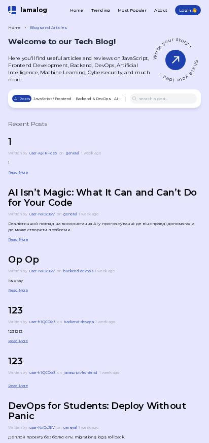
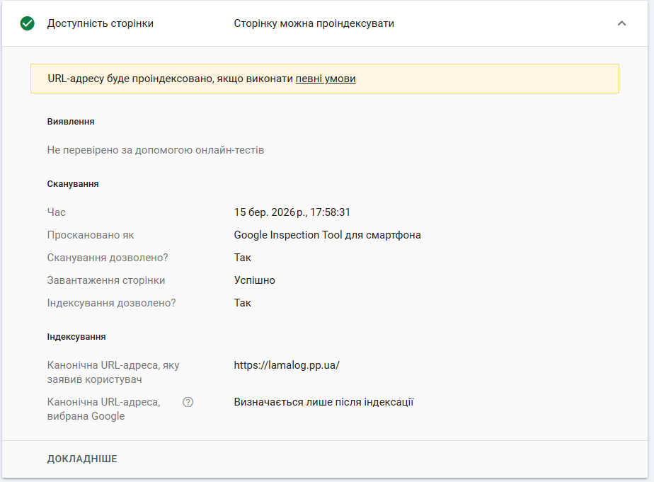
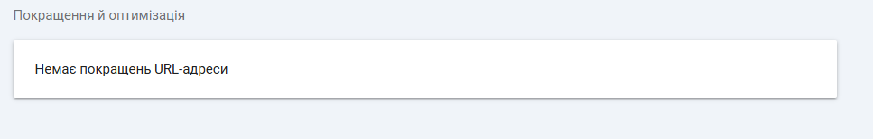
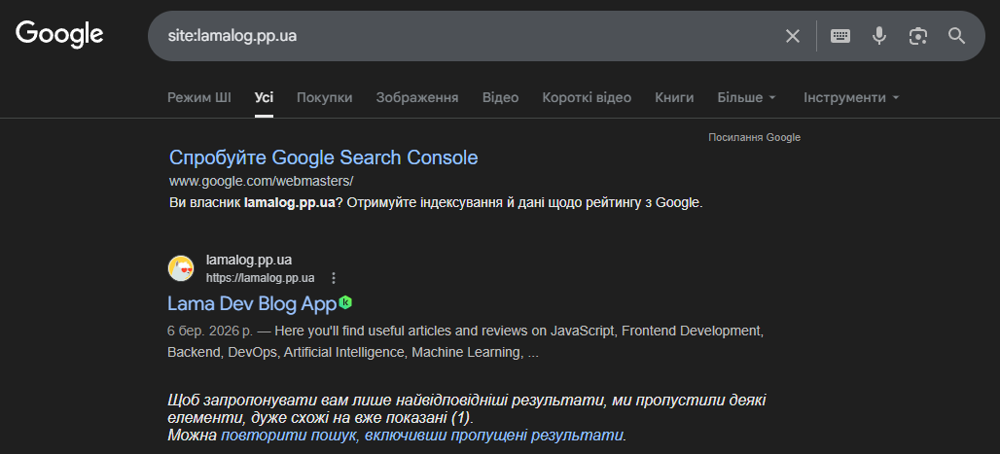
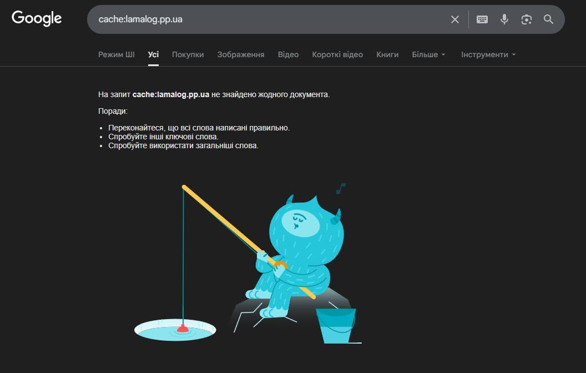
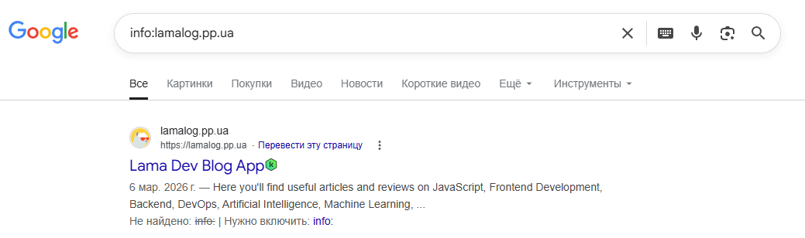
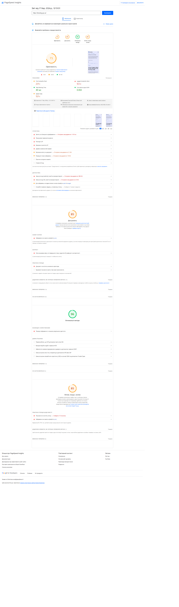
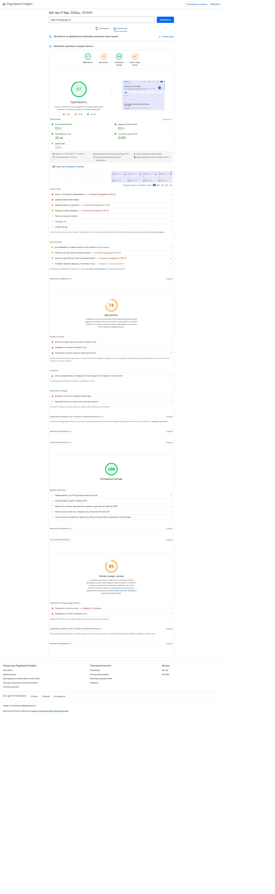

# Лабораторна робота №2. Індексація та алгоритми Google

---

## Мета

Навчитись перевіряти стан індексації сайту через Google Search Console, зрозуміти статуси
Coverage Report, впровадити E-E-A-T-сигнали у власний проєкт та отримати базовий Lighthouse звіт як точку відліку для
подальшої оптимізації.

---

## Завдання

### 1. Перевірка поточного стану індексації

#### 1.1 - URL Inspection у GSC

- Відкрити [Google Search Console](https://search.google.com/search-console)
- Перейти до інструменту `URL Inspection`
- Перевірити головну сторінку сайту
- Зафіксувати у звіті:

| Параметр                           | Значення |
|------------------------------------|----------|
| Статус індексації                  |проіндексовано          |
| Дата останнього crawl              |13 бер. 2026 р., 01:43:08          |
| Метод виявлення URL                |Файли Sitemap          |
| Чи дозволено індексацію robots.txt |Так          |
| Чи є canonical                     |https://lamalog.pp.ua/          |
| Статус рендерингу (screenshot)     |Сторінка завантажена успішно          |



- Зробити скріншот вкладки **"Coverage"** та **"Enhancements"**





#### 1.2 - Перевірка через пошукові оператори

Виконати наступні запити в Google та зафіксувати результати:

```
site:ваш-домен.pp.ua
cache:ваш-домен.pp.ua
info:ваш-домен.pp.ua
```

| Оператор | Результат | Що це означає |
|----------|-----------|---------------|
| site:    | Показує сторінку lamalog.pp.ua у результатах пошуку | Оператор дозволяє побачити всі сторінки сайту, які знаходяться в індексі Google |
| cache:   | Збережена копія сторінки не знайдена | Це означає, що Google ще не створив кеш сторінки або оператор cache більше не підтримується повністю |
| info:    | Показує сторінку lamalog.pp.ua у результатах пошуку | Раніше оператор показував інформацію про сторінку, але зараз Google частково припинив його підтримку |







> **Очікуваний результат:** сайт може ще не з'явитись у результатах - це нормально для нового домену. Важливо
> зафіксувати поточний стан і розуміти чому так відбувається.

#### 1.3 - Аналіз статусів Coverage Report

Нижче наведено типові статуси які можна побачити у GSC Coverage Report. Для кожного статусу - напишіть пояснення своїми
словами та вкажіть можливу причину:

| Статус | Пояснення | Можлива причина |
|---|---|---|
| Submitted and indexed | Сторінка була надіслана через sitemap або вручну і успішно додана до індексу Google. | Сторінка доступна для сканування, не має технічних помилок і містить корисний контент. |
| Crawled - currently not indexed | Google просканував сторінку, але вирішив тимчасово не додавати її до індексу. | Низька якість контенту, дублювання сторінок або недостатня цінність для користувачів. |
| Discovered - currently not indexed | Google знає про існування сторінки, але ще не просканував її. | Новий сайт, недостатній crawl budget або велика кількість сторінок. |
| Excluded by noindex tag | Сторінка має тег `noindex`, тому Google не додає її до індексу. | Розробник або SEO спеціально заборонив індексацію цієї сторінки. |
| Blocked by robots.txt | Доступ до сторінки заборонений у файлі robots.txt. | У robots.txt прописано правило `Disallow`, яке блокує сканування сторінки. |
| Redirect error | Під час переходу за URL виникла помилка редиректу. | Неправильна конфігурація redirect або циклічний редирект між сторінками. |
| 404 Not Found | Сторінка не існує на сервері і повертає код помилки 404. | Сторінка була видалена або посилання на неї неправильне. |
| Soft 404 | Сторінка виглядає як помилка або порожня, але сервер повертає код 200 замість 404. | Порожній або дуже короткий контент, неправильна обробка помилок на сайті. |

> [Документація GSC](https://support.google.com/webmasters/answer/7440203) для дослідження кожного статусу

---

### 2. Аналіз алгоритмів Google на реальних прикладах

Для кожного алгоритму знайти реальний кейс (новина, кейс-стаді, форум) де сайт постраждав або виграв після оновлення.
Заповніть таблицю:

| Алгоритм | Рік запуску | На що впливає | Реальний кейс (посилання) | Що треба робити |
|---|---|---|---|---|
| Panda | 2011 | Якість контенту, унікальність текстів, дублікати | https://searchengineland.com/google-panda-update-what-you-need-to-know-244584 | Створювати унікальний та корисний контент, уникати копіювання текстів і сторінок з низькою якістю. |
| Penguin | 2012 | Якість зовнішніх посилань (backlinks), боротьба зі спамними лінками | https://searchengineland.com/google-penguin-update-what-you-need-to-know-244584 | Отримувати природні посилання, не використовувати куплені або спамні backlinks. |
| BERT | 2019 | Розуміння природної мови у пошукових запитах | https://blog.google/products/search/search-language-understanding-bert/ | Писати тексти для людей, використовувати природну мову та відповідати на реальні запити користувачів. |

- Який з цих алгоритмів найбільш релевантний для вашого сайту? Чому?
---
Найбільш релевантним для нашого сайту є алгоритм BERT, оскільки він аналізує природну мову та допомагає Google краще розуміти зміст сторінок і запитів користувачів. Для блогу або інформаційного сайту важливо писати зрозумілий та корисний контент, який відповідає на запити користувачів.

- Як BERT змінив підхід до написання контенту порівняно з Panda?
---
Алгоритм Panda зосереджувався переважно на якості контенту та боротьбі з дубльованими або низькоякісними текстами. BERT пішов далі та почав аналізувати контекст і природну мову, щоб краще розуміти зміст запитів користувачів. Тому сьогодні важливо писати тексти природною мовою, орієнтуючись на потреби користувачів, а не лише на ключові слова.

---

### 3. Впровадження E-E-A-T у проєкт

E-E-A-T (Experience, Expertise, Authoritativeness, Trustworthiness) - це набір сигналів якими Google оцінює якість та
надійність сайту. Завдання: впровадити конкретні E-E-A-T елементи у проєкт.

#### 3.1 - Сторінка "Про нас" `/about`

Створити та наповнити сторінку `/about` яка містить:

- Назва та опис блогу (чим займається, для кого)
- Місія або редакційна політика
- Контактна інформація (email або форма)
- Посилання на соцмережі проєкту
- Дата заснування

#### 3.2 - Профілі авторів

Для кожного автора в базі даних заповнити:

- Повне ім'я (не нікнейм)
- Фото або аватар
- Коротка біографія (2-3 речення про експертизу)
- Посилання на LinkedIn або GitHub
- Кількість опублікованих статей

Переконатись що сторінка `/authors/[slug]` відображає всі ці дані.

#### 3.3 - Підпис автора на сторінці статті

На сторінці `/articles/[slug]` додати блок автора який містить:

- Фото автора
- Ім'я з посиланням на `/authors/[slug]`
- Коротке bio (1-2 речення)
- Дата публікації та дата останнього оновлення

#### 3.4 - E-E-A-T чек-ліст

Після виконання завдань заповнити чек-ліст:

**Experience (Досвід)**

- Статті написані від першої особи або містять особистий досвід
- Є конкретні приклади, скріншоти, кейси

**Expertise (Експертиза)**

- Профіль автора підтверджує компетентність у темі
- Статті містять технічно точну інформацію
- Є посилання на авторитетні джерела

**Authoritativeness (Авторитетність)**

- Сторінка `/about` з описом редакції
- Автори мають публічні профілі (LinkedIn/GitHub)
- Наявні зовнішні посилання на сайт (backlinks)

**Trustworthiness (Надійність)**

- Сайт працює через HTTPS
- Є контактна інформація
- Дати публікацій відображаються коректно
- Немає битих посилань

---

### 4. Базовий Lighthouse звіт

Цей крок фіксує **поточний стан** продуктивності сайту до будь-якої оптимізації. Ці дані будуть точкою порівняння в
майбутніх лабораторних.

#### 4.1 - Запустити PageSpeed Insights

- Перейти на [pagespeed.web.dev](https://pagespeed.web.dev)
- Ввести URL головної сторінки сайту
- Запустити аналіз для **Mobile** та **Desktop**






#### 4.2 - Зафіксувати показники

| Метрика | Mobile | Desktop |
|---|---|---|
| Performance Score | 71 | 97 |
| SEO Score | 96 | 100 |
| Accessibility Score | 85 | 74 |
| Best Practices Score | 85 | 85 |
| **LCP** (Largest Contentful Paint) | 2.9 s | 0.9 s |
| **CLS** (Cumulative Layout Shift) | 0.002 | 0.005 |
| **INP** (Interaction to Next Paint) | 404 ms | 20 ms |
| **FCP** (First Contentful Paint) | 5.0 s | 1.5 s |
| **TTFB** (Time to First Byte) | 5.5 s | ~0.9 s |

#### 4.3 - Аналіз результатів

У звіті відповісти на питання:

1. Які метрики у червоній зоні? Що це означає для користувача?
---
У червоній зоні знаходиться метрика FCP (First Contentful Paint) на мобільних пристроях — приблизно 5 секунд. Це означає, що користувач бачить перший контент сторінки із значною затримкою. Для користувача це виглядає як повільне завантаження сайту і може негативно впливати на досвід використання.

2. Які три проблеми PageSpeed вважає найкритичнішими?
---
Найкритичнішими проблемами є:
- повільний час відповіді сервера (TTFB);
- затримка завантаження першого контенту (FCP);
- велика кількість або розмір ресурсів JavaScript та CSS, які блокують рендеринг сторінки.

3. Порівняй результати Mobile vs Desktop - чому вони відрізняються?
---
Результати Mobile і Desktop відрізняються через різні умови тестування. Для мобільних пристроїв PageSpeed використовує повільніший процесор і мобільну мережу, щоб змоделювати реальні умови користування. Тому показники продуктивності на мобільних пристроях зазвичай нижчі. На Desktop сторінка завантажується швидше завдяки більш потужному обладнанню та швидшому інтернет-з'єднанню.

> **Важливо:** не намагайся виправляти проблеми зараз. Мета - зрозуміти поточний стан. Оптимізація буде в наступних
> лабораторних роботах.

---

### Результати для звіту

```
1. Скріншот URL Inspection з GSC (головна сторінка)
2. Результати site:, cache:, info: операторів
3. Заповнена таблиця статусів Coverage Report з поясненнями
4. Таблиця алгоритмів Google з реальними кейсами
5. Скріншот сторінки /about
6. Скріншот профілю автора на сторінці статті
7. Заповнений E-E-A-T  чек-ліст
8. Скріншоти PageSpeed Insights (Mobile + Desktop)
9. Заповнена таблиця Lighthouse метрик
10. Аналіз результатів Lighthouse
```

---

## Контрольні питання

### Рівень 1 - Розуміння термінів

1. Що означає статус "Discovered - currently not indexed" і чому Google може не індексувати сторінку навіть якщо знайшов
   її?
2. Яка різниця між `crawling` та `indexing`? Чи може сторінка бути crawled, але не indexed?
3. Що таке "crawl budget" і чому він важливий для великих сайтів?
4. Поясніть що означає кожна літера в абревіатурі E-E-A-T.
5. Що таке LCP, CLS та INP? Які порогові значення вважаються "оптимальними"?

### Рівень 2 - Аналіз

6. Алгоритм Panda карає за "thin content". Наведіть три приклади thin content який міг би з'явитись на вашому сайті та
   пояснити як його уникнути.
7. Чому алгоритм BERT змінив підхід до keyword stuffing? Як він аналізує текст інакше ніж попередні алгоритми?
8. Ваш сайт отримав низький Performance Score на мобільному пристрої. Назвіть три найпоширеніші причини цього і як їх
   виправити.
9. Чому Google надає перевагу сайтам з чітко вираженим авторством? Як це пов'язано з алгоритмом Helpful Content?
10. Що таке "Soft 404" і чим він небезпечніший за звичайний 404 з точки зору SEO?

### Рівень 3 - Синтез та висновки

11. Проаналізуйте свій E-E-A-T чек-ліст. Які три найслабші місця вашого проекту з точки зору E-E-A-T? Запропонуйте план
    покращення.
12. Уявіть, що після оновлення Helpful Content ваш сайт втратив 40% трафіку. Які кроки ви зробите для діагностики та
    відновлення позицій?
13. Порівняйте Lighthouse показники вашого сайту з показниками відомого IT-блогу, порталу тощо (наприклад css-tricks.com
    або dev.to). Що
    відрізняється і чому?
14. Які з Core Web Vitals метрик безпосередньо впливають на ранжування в Google і які лише рекомендовані? Знайдіть
    офіційне підтвердження вашої відповіді.

---

## Критерії оцінювання

| Завдання                               | Балів  |
|----------------------------------------|--------|
| URL Inspection + таблиця параметрів    | 1      |
| Аналіз Coverage Report статусів        | 2      |
| Таблиця алгоритмів з реальними кейсами | 2      |
| Сторінка /about створена та наповнена  | 1      |
| Профіль автора на сторінці статті      | 1      |
| E-E-A-T чек-ліст заповнений            | 1      |
| Lighthouse звіт + аналіз               | 2      |
| **Разом**                              | **10** |
