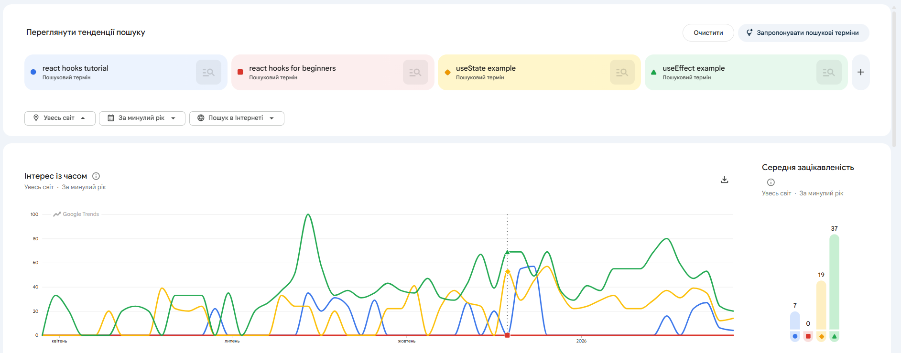

# Лабораторна робота №3. Семантичне ядро та структура сайту (IT-блог)

## Мета роботи

Мета лабораторної: навчитися практично будувати SEO-структуру контентного IT-сайту через:
- класифікацію пошукових запитів за інтентом;
- формування семантичного ядра у табличному форматі;
- кластеризацію ключів у групи під окремі сторінки;
- проектування silo-архітектури та логіки внутрішньої перелінковки.

Обрана тематика проєкту: **IT-блог** (JavaScript, React, Node.js, DevOps, Git, Career).

---

## 1. Класифікація пошукових запитів

### 1.1 Теоретична база (search intent)

У роботі використано 4 типи інтенту:

1. `informational` — користувач хоче дізнатись або зрозуміти тему.
2. `navigational` — користувач шукає конкретний сайт/сервіс/бренд.
3. `transactional` — користувач хоче виконати дію (встановити, почати, скористатись).
4. `commercial` — користувач порівнює варіанти перед вибором.

### 1.2 Практична класифікація

Початково було зібрано 20 запитів по IT-тематиці та розподілено по 4 типах інтенту. 
Мінімальна умова (не менше 4 запитів на кожен тип) дотримана.

### 1.3 Аналіз SERP через Google Search

Для запитів:
- `react hooks tutorial`
- `docker tutorial`
- `react vs vue`

було перевірено:
- блок `People also ask`;
- блок `Related searches`;
- варіанти `Autocomplete`.

Релевантні формулювання інтегровано у фінальне семантичне ядро.

---

## 2. Збір семантичного ядра

### 2.1 Формат таблиці Keywords

У Google Sheets використано колонки:
- `keyword`
- `intent`
- `volume`
- `competition`
- `cluster`
- `target_page`
- `priority`
- `notes`

### 2.2 Джерела даних

Для заповнення `volume` та `competition` використано Google Keyword Planner (окремі прогони для EN/UKR).

Скріншоти:
- EN (Ukraine): 
- UKR (Ukraine): 

### 2.3 Розширення через Google Trends

Для перевірки сезонності та варіантів формулювань порівняно 4 групи близьких запитів:

1. JavaScript group:
- `javascript tutorial`
- `javascript for beginners`
- `what is javascript`
- `learn javascript`

2. React Hooks group:
- `react hooks tutorial`
- `react hooks for beginners`
- `useState example`
- `useEffect example`

3. Node.js group:
- `node.js tutorial`
- `node.js for beginners`
- `how to install node.js`
- `node.js api tutorial`

4. DevOps group:
- `docker tutorial`
- `docker compose example`
- `kubernetes basics`
- `devops roadmap`

Що саме аналізувалося у Trends:
- лідер запиту всередині групи;
- наявність піків попиту по місяцях;
- стабільність/зростання/спад інтересу.

Скріншот прикладу порівняння:
- IT variants comparison: 

Нотатки по сезонності внесені в колонку `notes` для кожного ключа.

### 2.4 Обсяг ядра

Фінальний обсяг семантичного ядра: **40 ключових запитів**.

Файл для швидкого імпорту:
- [keywords_it_blog.tsv](d:\CHNU_(Master)\SEO_2\Fullstack_project\Fullstack_project\keywords_it_blog.tsv)

---

## 3. Кластеризація запитів

### 3.1 Принцип кластеризації

Ключові слова об'єднувались у кластер, якщо:
- мають спільну тему;
- мають схожий інтент;
- можуть бути закриті однією сторінкою (category або article).

### 3.2 Результат кластеризації

Отримано 8 кластерів у форматі `kebab-case`:
- `javascript-basics`
- `javascript-async`
- `react-hooks`
- `frontend-comparison`
- `nodejs-basics`
- `devops-basics`
- `git-workflow`
- `career-learning`

Це перевищує мінімальну вимогу (>=6).

Файл кластерів:
- [clusters_it_blog.tsv](d:\CHNU_(Master)\SEO_2\Fullstack_project\Fullstack_project\clusters_it_blog.tsv)

---

## 4. Побудова silo-структури

### 4.1 Логіка структури

Структура спроєктована у 4 рівні:
- Рівень 0: головна `/`
- Рівень 1: категорії-силоси (`/categories/...`)
- Рівень 2: статті (`/articles/...`)
- Рівень 3: службові сторінки (`/about`, `/authors`, `/tags/[slug]`, `/search`)

Файл структури:
- [structure_it_blog.tsv](d:\CHNU_(Master)\SEO_2\Fullstack_project\Fullstack_project\structure_it_blog.tsv)

### 4.2 Внутрішня перелінковка

Перелінковка спроєктована трьома типами:
- `contextual` (із категорії в релевантні статті);
- `related` (між спорідненими статтями);
- `breadcrumb/menu` (навігаційна ієрархія).

Кількість описаних внутрішніх посилань: **24** (мінімум був 10).

Файл перелінковки:
- [internal_links_it_blog.tsv](d:\CHNU_(Master)\SEO_2\Fullstack_project\Fullstack_project\internal_links_it_blog.tsv)

### 4.3 Контрольні питання

1. Чи кожна категорія окремий силос?
- Так. Категорії тематично розділені: JavaScript, React, Node.js, DevOps, Git, Career.

2. Чи є перехресні посилання між силосами?
- Так, але тільки контекстні (related links), коли це реально допомагає користувачу.

3. Максимальна глибина кліків від головної до статті?
- 3 кліки: `/` -> `/categories/...` -> `/articles/...`.

4. Чи є orphan pages?
- Ні. Для ключових сторінок передбачені вхідні посилання з категорій, меню або related-блоків.

---

## 5. Підсумок виконання вимог

Вимоги лабораторної закриті:
- `Keywords` — 40 ключів (виконано);
- `Clusters` — 8 кластерів (виконано);
- `Structure` — усі рівні (виконано);
- `InternalLinks` — 24 посилання (виконано);
- скріншоти Keyword Planner (EN + UKR) (виконано);
- скріншот Google Trends (виконано);
- відповіді на контрольні питання (виконано).

---

## 6. Пакет для Google Sheets

Імпорт у `A1` відповідних аркушів:
- `Keywords`: [keywords_it_blog.tsv](d:\CHNU_(Master)\SEO_2\Fullstack_project\Fullstack_project\keywords_it_blog.tsv)
- `Clusters`: [clusters_it_blog.tsv](d:\CHNU_(Master)\SEO_2\Fullstack_project\Fullstack_project\clusters_it_blog.tsv)
- `Structure`: [structure_it_blog.tsv](d:\CHNU_(Master)\SEO_2\Fullstack_project\Fullstack_project\structure_it_blog.tsv)
- `InternalLinks`: [internal_links_it_blog.tsv](d:\CHNU_(Master)\SEO_2\Fullstack_project\Fullstack_project\internal_links_it_blog.tsv)

Посилання на Google Sheets:
- https://docs.google.com/spreadsheets/d/1DwbDk32QMn_SHBu6StWJBqq7bKUZTq0D-EdYlxwHSp4/edit?usp=sharing
