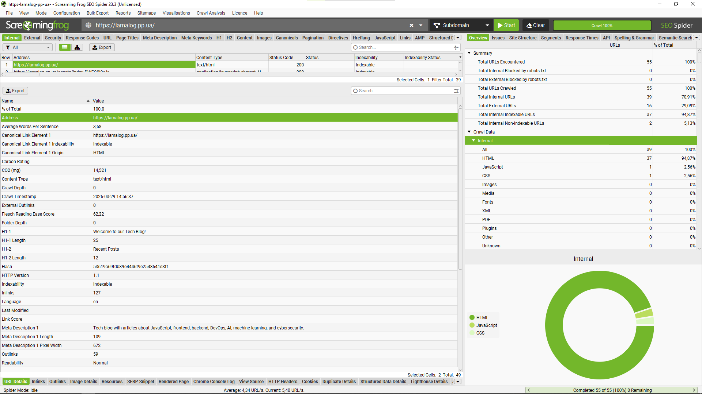
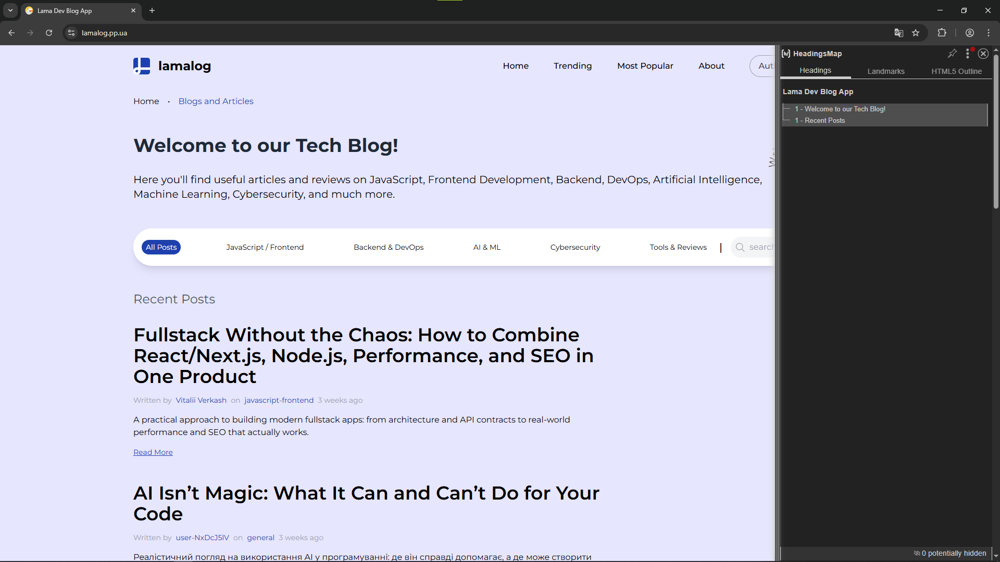
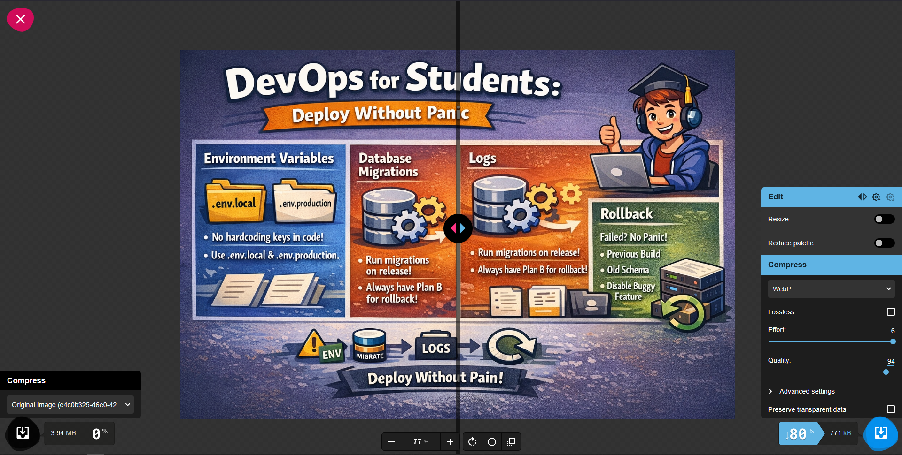
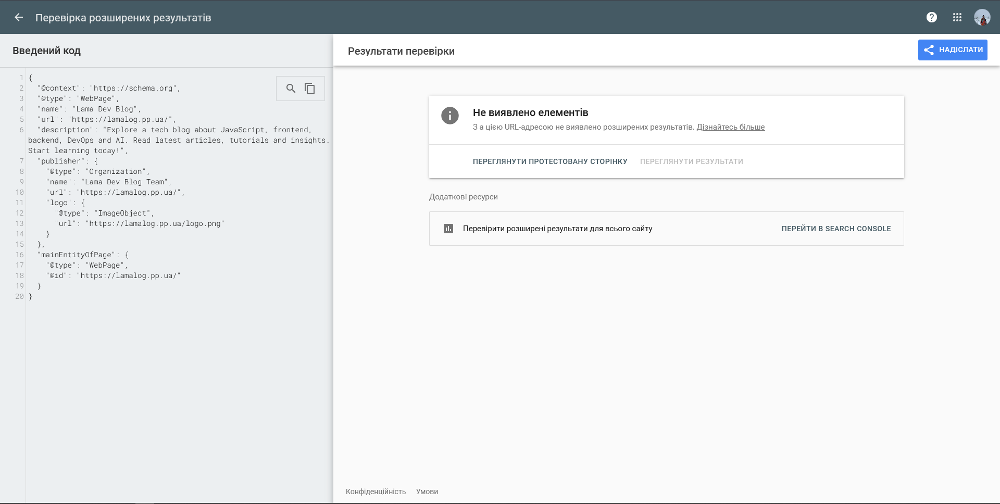
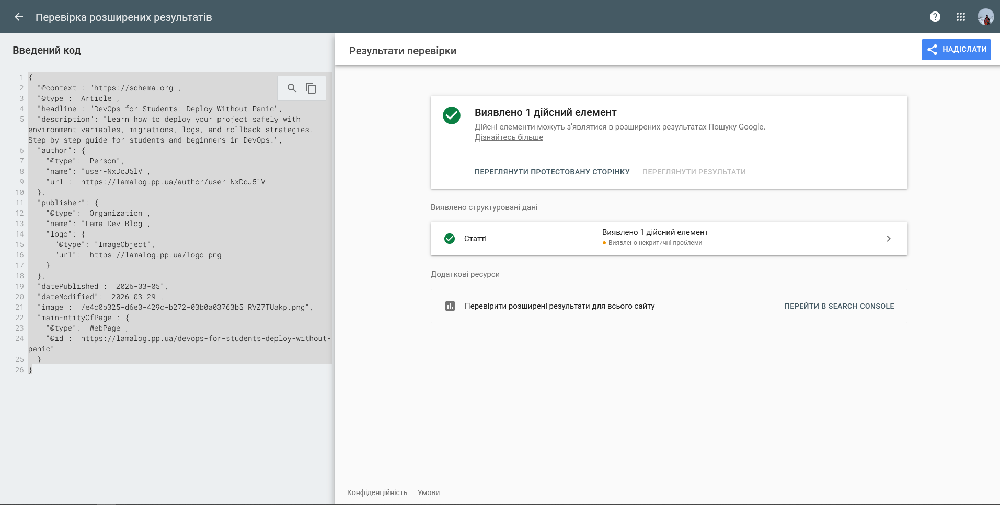
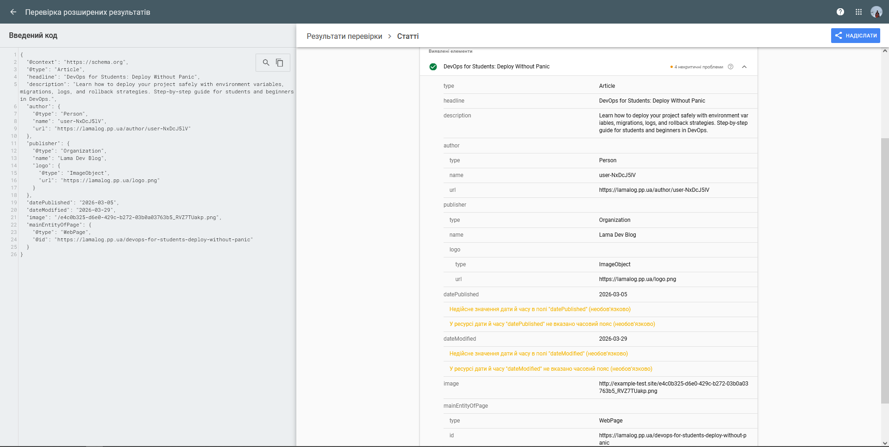

# Лабораторна робота №4. Контент і On-Page SEO

## Мета роботи

Навчитись оптимізувати сторінки сайту відповідно до вимог on-page SEO: правильно формувати мета-теги, заголовки та URL-структуру, писати SEO-текст для реальної аудиторії, додавати структуровані дані Schema.org та перевіряти релевантність сторінки цільовому запиту за допомогою спеціалізованих інструментів.

## Завдання

## 1. Оптимізація сторінки

### 1.1 Аудит поточного стану

Для on-page аудиту обрали головну сторінку проєкту.
Таблиця поточний стан відображає ключові висновки та напрямки оптимізації.

| Елемент            | Поточне значення                                                                                                             | Відповідає нормі? | Проблема                                   |
| ------------------ | ---------------------------------------------------------------------------------------------------------------------------- | ----------------- | ------------------------------------------ |
| `<title>`          | Lama Dev Blog App (17 символів)                                                                                              | Ні                | Занадто короткий, не містить ключових слів |
| `meta description` | Tech blog with articles about JavaScript, frontend, backend, DevOps, AI, machine learning, and cybersecurity. (109 символів) | Так               | Занадто короткий, не містить ключових слів |
| `H1`               | Welcome to our Tech Blog! (є також ще один H1 — "Recent Posts")                                                              | Ні                | Два H1 на сторінці (має бути один)         |
| `Кількість H2`     | 0 (обидва заголовки позначені як H1)                                                                                         | Ні                | Відсутня правильна ієрархія заголовків     |
| `URL`              | https://lamalog.pp.ua/                                                                                                       | Так               | Немає                                      |
| `Alt у зображень`  | Немає даних                                                                                                                  | Ні                | Відсутні alt-атрибути                      |
| `Schema.org`       | Відсутня                                                                                                                     | Ні                | Немає структурованих даних                 |
| `Canonical`        | https://lamalog.pp.ua/                                                                                                       | Так               | Немає                                      |

Норми для перевірки:

| Елемент            | Норма                                                                    |
| ------------------ | ------------------------------------------------------------------------ |
| `<title>`          | 50–60 символів, ключове слово на початку, унікальний                     |
| `meta description` | 150–160 символів, є заклик до дії, унікальна                             |
| `H1`               | рівно один на сторінку, містить головний запит                           |
| `Ієрархія H1–H6`   | без пропуску рівнів, логічна вкладеність                                 |
| `URL`              | нижній регістр, дефіс як роздільник, без кирилиці, без зайвих параметрів |
| `Alt зображень`    | описовий текст, не порожній, не img123                                   |
| `Canonical`        | присутній, вказує на правильний URL без UTM-параметрів                   |

Скріншот результату з Screaming Frog SEO Spider:



### 1.2 Оптимізація мета-тегів

На основі аудиту написали оптимізовані варіанти для обраної сторінки.

**Title**

```
До:                      Lama Dev Blog App
Після:                   Tech Blog про JavaScript, AI, DevOps та Backend | Lama Dev
Довжина:                 63 символи
Позиція ключового слова: перші 3 слова
```

Пояснення

- Додано ключовий запит “Tech Blog” на початок
- Розширено за рахунок популярних тем (JS, AI, DevOps)
- Додано бренд у кінець

**Meta description**

```
До:                      Tech blog with articles about JavaScript, frontend, backend, DevOps, AI, machine learning, and cybersecurity.
Після:                   Explore a tech blog about JavaScript, frontend, backend, DevOps and AI. Read latest articles, tutorials and insights. Start learning today!
Довжина:                 149 символи
Є CTA (заклик до дії):   Так
```

Пояснення

- Додано CTA: “Start learning today!”
- Трохи “оживлено” текст (не просто перелік)
- Ключ вставлено природно

**H1**

```
До:                      Welcome to our Tech Blog! (також є другий H1: Recent Posts)
Після:                   Tech Blog: JavaScript, Frontend, Backend та AI
Містить цільовий запит:  Так
```

Пояснення

- Чіткий, SEO-орієнтований заголовок
- Один H1 замість двох
- Включає ключ

**URL**

```
До:                      https://lamalog.pp.ua/
Після:                   https://lamalog.pp.ua/
Зміни:                   Немає
```

Пояснення

- URL вже оптимальний (короткий, без зайвих параметрів)
- Для головної сторінки змінювати не потрібно

### 1.3 Оптимізація структури заголовків

За допомогою розширення HeadingsMap зняли скріншот поточної ієрархії заголовків обраної сторінки.


Виправлена структура заголовків у форматі дерева.

```
H1: Tech Blog: JavaScript, Frontend, Backend та AI

  p: Explore articles on JavaScript, frontend and backend development, DevOps, AI, machine learning, and cybersecurity.

  H2: Latest Tech Articles
    H3: [Post Title 1]
    H3: [Post Title 2]
    H3: [Post Title 3]
```

Пояснення

Обрана структура забезпечує чітку ієрархію заголовків, де один H1 описує всю сторінку. H2 виділяє основні секції — останні технічні статті, а H3 підпорядковує назви постів конкретній секції. Ключові слова закладені у H1 (“Tech Blog”, “JavaScript”, “Frontend”, “Backend”, “AI”) та H2 (“Latest Tech Articles”), що допомагає Google правильно індексувати тематику блогу та підвищує релевантність сторінки під запити користувачів.

### 1.4 Оптимізація зображень

Для аналізу на сторінці відібрали 3 зображення, результати яких зафіксовано у таблиці.
| Зображення | Поточний alt | Поточний формат | Розмір файлу | Оптимізований alt | Рекомендований формат |
| -------------------------------------------------- | --------- | --- | ------- | -------------------------------------------------------------------------------- | ---- |
| c9b83101-4b63-4991-89a7-be20eef37545\*7ShkRfYY9.png | відсутній | PNG | 2.65 MB | DevOps deployment guide with env, migrations, logs, and rollback | WebP |
| 245b9532-b851-4a90-b6dd-2fa6818614f6\_-4mgZZ4Ma.png | відсутній | PNG | 2.64 MB | Node.js backend guide showing validation, error handling, and project structure | WebP |
| logo.png | Lama Logo | PNG | 4.66 KB | Lama Dev Blog logo | SVG |

Для одного з зображень виконали реальну конвертацію через Squoosh.


```
Вихідний файл: c9b83101-4b63-4991-89a7-be20eef37545\*7ShkRfYY9.png, розмір 2.65 MB
Формат на виході: WebP
Результат: c9b83101-4b63-4991-89a7-be20eef37545\*7ShkRfYY9.webp, розмір 771 kB
Економія: 80% від початкового розміру
```

### 1.5 Schema.org розмітка

Написали JSON-LD розмітку для обраної сторінки. Тип обрали відповідно до контенту. Головна сторінка блогу, тому найдоречніше використовувати тип Article, або для головної сторінки блогу можна обрати WebPage + Organization, якщо розглядати її як landing.

```
{
  "@context": "https://schema.org",
  "@type": "WebPage",
  "name": "Lama Dev Blog",
  "url": "https://lamalog.pp.ua/",
  "description": "Explore a tech blog about JavaScript, frontend, backend, DevOps and AI. Read latest articles, tutorials and insights. Start learning today!",
  "publisher": {
    "@type": "Organization",
    "name": "Lama Dev Blog Team",
    "url": "https://lamalog.pp.ua/",
    "logo": {
      "@type": "ImageObject",
      "url": "https://lamalog.pp.ua/logo.png"
    }
  },
  "mainEntityOfPage": {
    "@type": "WebPage",
    "@id": "https://lamalog.pp.ua/"
  }
}
```



Це стандартна поведінка Google Rich Results Test для головної сторінки блогу без конкретної статті.

Причина:

- Тип WebPage не генерує Rich Snippet сам по собі.
- Google не показує “Article” для головної сторінки, бо там немає одного конкретного поста.
- Rich Results з’являються для Article, Product, FAQPage, Recipe тощо, де є чіткий контент.

---

```
{
  "@context": "https://schema.org",
  "@type": "Article",
  "headline": "DevOps for Students: Deploy Without Panic",
  "description": "Learn how to deploy your project safely with environment variables, migrations, logs, and rollback strategies. Step-by-step guide for students and beginners in DevOps.",
  "author": {
    "@type": "Person",
    "name": "user-NxDcJ5lV",
    "url": "https://lamalog.pp.ua/author/user-NxDcJ5lV"
  },
  "publisher": {
    "@type": "Organization",
    "name": "Lama Dev Blog",
    "logo": {
      "@type": "ImageObject",
      "url": "https://lamalog.pp.ua/logo.png"
    }
  },
  "datePublished": "2026-03-05",
  "dateModified": "2026-03-29",
  "image": "/e4c0b325-d6e0-429c-b272-03b0a03763b5_RVZ7TUakp.png",
  "mainEntityOfPage": {
    "@type": "WebPage",
    "@id": "https://lamalog.pp.ua/devops-for-students-deploy-without-panic"
  }
}
```



Це означає, що JSON-LD розмітка для статті коректна, і Google її визнає дійсною.

Також можемо переглянути деталі виявленого елемента.

