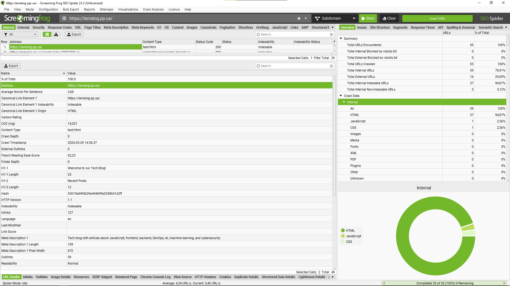
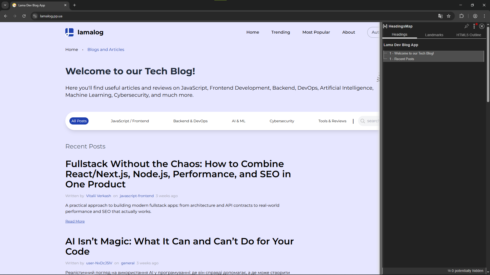
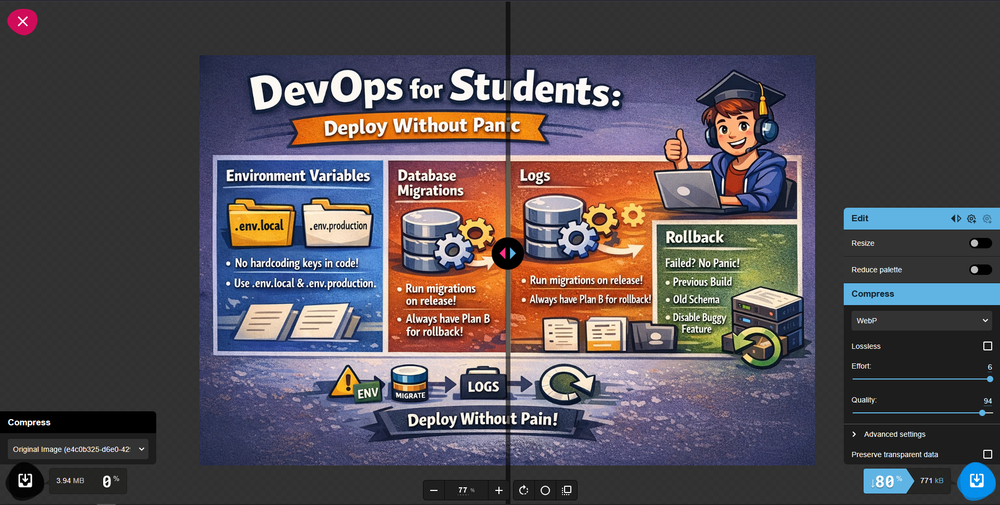
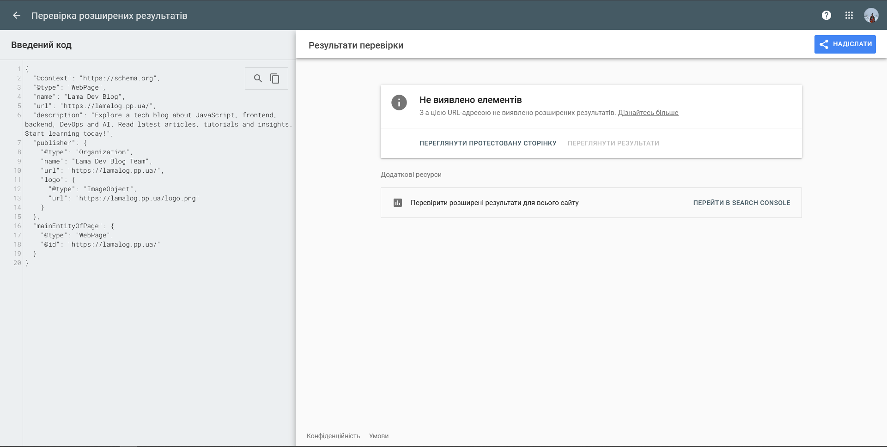
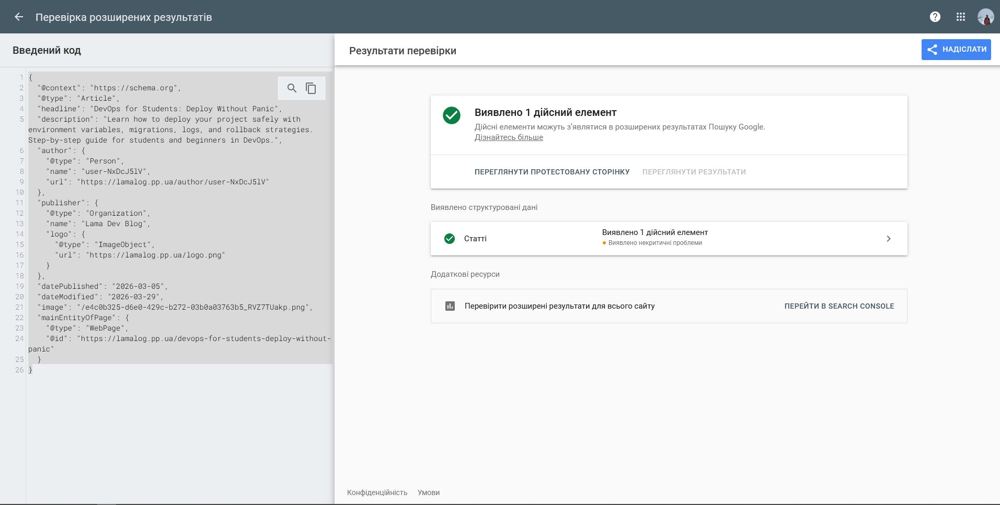
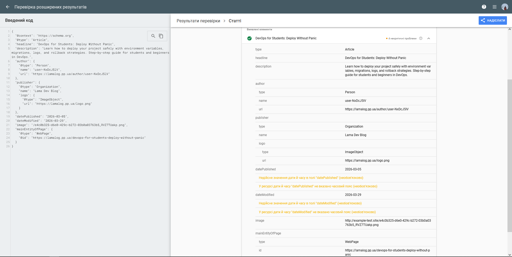
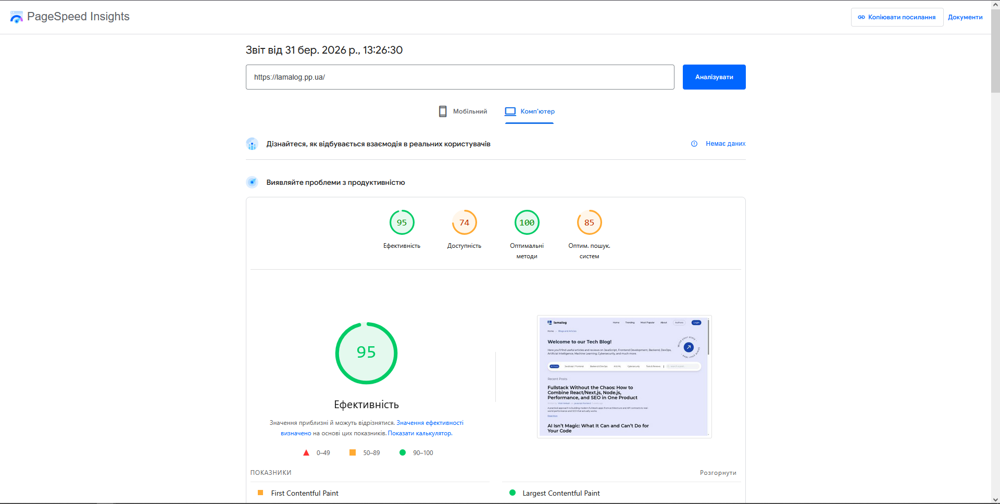
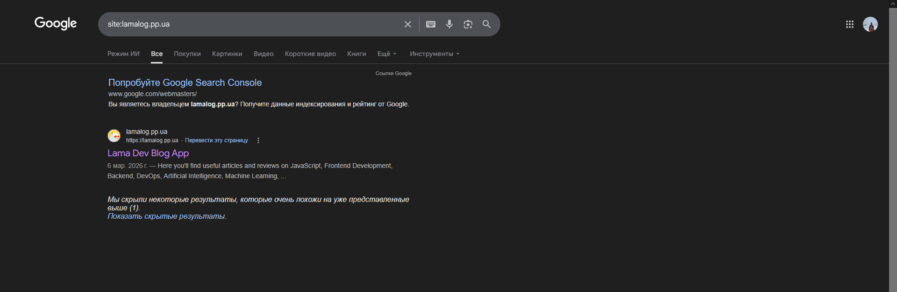
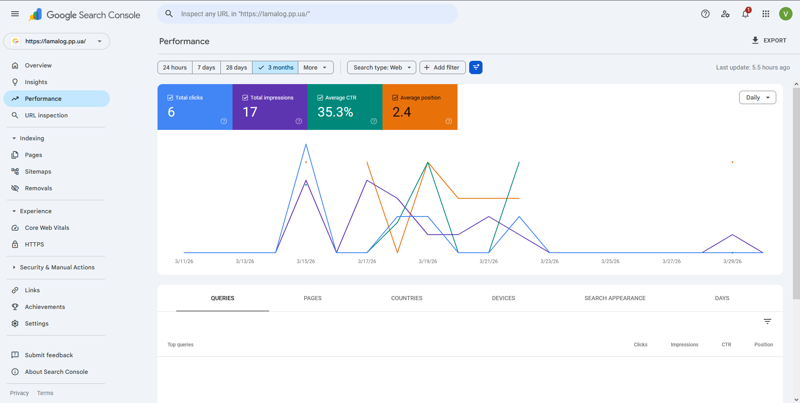

# Лабораторна робота №4. Контент і On-Page SEO

## Мета роботи

Навчитись оптимізувати сторінки сайту відповідно до вимог on-page SEO: правильно формувати мета-теги, заголовки та URL-структуру, писати SEO-текст для реальної аудиторії, додавати структуровані дані Schema.org та перевіряти релевантність сторінки цільовому запиту за допомогою спеціалізованих інструментів.

## Завдання

## 1. Оптимізація сторінки

### 1.1 Аудит поточного стану

Для on-page аудиту обрали головну сторінку проєкту.
Таблиця поточний стан відображає ключові висновки та напрямки оптимізації.

| Елемент            | Поточне значення                                                                                                             | Відповідає нормі? | Проблема                                   |
| ------------------ | ---------------------------------------------------------------------------------------------------------------------------- | ----------------- | ------------------------------------------ |
| `<title>`          | Lama Dev Blog App (17 символів)                                                                                              | Ні                | Занадто короткий, не містить ключових слів |
| `meta description` | Tech blog with articles about JavaScript, frontend, backend, DevOps, AI, machine learning, and cybersecurity. (109 символів) | Так               | Занадто короткий, не містить ключових слів |
| `H1`               | Welcome to our Tech Blog! (є також ще один H1 — "Recent Posts")                                                              | Ні                | Два H1 на сторінці (має бути один)         |
| `Кількість H2`     | 2 (обидва заголовки позначені як H1)                                                                                         | Ні                | Відсутня правильна ієрархія заголовків     |
| `URL`              | https://lamalog.pp.ua/                                                                                                       | Так               | Немає                                      |
| `Alt у зображень`  | Немає даних                                                                                                                  | Ні                | Відсутні alt-атрибути                      |
| `Schema.org`       | Відсутня                                                                                                                     | Ні                | Немає структурованих даних                 |
| `Canonical`        | https://lamalog.pp.ua/                                                                                                       | Так               | Немає                                      |

Норми для перевірки:

| Елемент            | Норма                                                                    |
| ------------------ | ------------------------------------------------------------------------ |
| `<title>`          | 50–60 символів, ключове слово на початку, унікальний                     |
| `meta description` | 150–160 символів, є заклик до дії, унікальна                             |
| `H1`               | рівно один на сторінку, містить головний запит                           |
| `Ієрархія H1–H6`   | без пропуску рівнів, логічна вкладеність                                 |
| `URL`              | нижній регістр, дефіс як роздільник, без кирилиці, без зайвих параметрів |
| `Alt зображень`    | описовий текст, не порожній, не img123                                   |
| `Canonical`        | присутній, вказує на правильний URL без UTM-параметрів                   |

Скріншот результату з Screaming Frog SEO Spider:



### 1.2 Оптимізація мета-тегів

На основі аудиту написали оптимізовані варіанти для обраної сторінки.

**Title**

```
До:                      Lama Dev Blog App
Після:                   Tech Blog про JavaScript, AI, DevOps та Backend | Lama Dev
Довжина:                 63 символи
Позиція ключового слова: перші 3 слова
```

Пояснення

- Додано ключовий запит “Tech Blog” на початок
- Розширено за рахунок популярних тем (JS, AI, DevOps)
- Додано бренд у кінець

**Meta description**

```
До:                      Tech blog with articles about JavaScript, frontend, backend, DevOps, AI, machine learning, and cybersecurity.
Після:                   Explore a tech blog about JavaScript, frontend, backend, DevOps and AI. Read latest articles, tutorials and insights. Start learning today!
Довжина:                 149 символи
Є CTA (заклик до дії):   Так
```

Пояснення

- Додано CTA: “Start learning today!”
- Трохи “оживлено” текст (не просто перелік)
- Ключ вставлено природно

**H1**

```
До:                      Welcome to our Tech Blog! (також є другий H1: Recent Posts)
Після:                   Tech Blog: JavaScript, Frontend, Backend та AI
Містить цільовий запит:  Так
```

Пояснення

- Чіткий, SEO-орієнтований заголовок
- Один H1 замість двох
- Включає ключ

**URL**

```
До:                      https://lamalog.pp.ua/
Після:                   https://lamalog.pp.ua/
Зміни:                   Немає
```

Пояснення

- URL вже оптимальний (короткий, без зайвих параметрів)
- Для головної сторінки змінювати не потрібно

### 1.3 Оптимізація структури заголовків

За допомогою розширення HeadingsMap зняли скріншот поточної ієрархії заголовків обраної сторінки.



Виправлена структура заголовків у форматі дерева.

```
H1: Tech Blog: JavaScript, Frontend, Backend та AI

  p: Explore articles on JavaScript, frontend and backend development, DevOps, AI, machine learning, and cybersecurity.

  H2: Latest Tech Articles
    H3: [Post Title 1]
    H3: [Post Title 2]
    H3: [Post Title 3]
```

Пояснення

Обрана структура забезпечує чітку ієрархію заголовків, де один H1 описує всю сторінку. H2 виділяє основні секції — останні технічні статті, а H3 підпорядковує назви постів конкретній секції. Ключові слова закладені у H1 (“Tech Blog”, “JavaScript”, “Frontend”, “Backend”, “AI”) та H2 (“Latest Tech Articles”), що допомагає Google правильно індексувати тематику блогу та підвищує релевантність сторінки під запити користувачів.

### 1.4 Оптимізація зображень

Для аналізу на сторінці відібрали 3 зображення, результати яких зафіксовано у таблиці.
| Зображення | Поточний alt | Поточний формат | Розмір файлу | Оптимізований alt | Рекомендований формат |
| -------------------------------------------------- | --------- | --- | ------- | -------------------------------------------------------------------------------- | ---- |
| c9b83101-4b63-4991-89a7-be20eef37545\*7ShkRfYY9.png | відсутній | PNG | 2.65 MB | DevOps deployment guide with env, migrations, logs, and rollback | WebP |
| 245b9532-b851-4a90-b6dd-2fa6818614f6\_-4mgZZ4Ma.png | відсутній | PNG | 2.64 MB | Node.js backend guide showing validation, error handling, and project structure | WebP |
| logo.png | Lama Logo | PNG | 4.66 KB | Lama Dev Blog logo | SVG |

Для одного з зображень виконали реальну конвертацію через Squoosh.



```
Вихідний файл: c9b83101-4b63-4991-89a7-be20eef37545\*7ShkRfYY9.png, розмір 2.65 MB
Формат на виході: WebP
Результат: c9b83101-4b63-4991-89a7-be20eef37545\*7ShkRfYY9.webp, розмір 771 kB
Економія: 80% від початкового розміру
```

### 1.5 Schema.org розмітка

Написали JSON-LD розмітку для обраної сторінки. Тип обрали відповідно до контенту. Головна сторінка блогу, тому найдоречніше використовувати тип Article, або для головної сторінки блогу можна обрати WebPage + Organization, якщо розглядати її як landing.

```
{
  "@context": "https://schema.org",
  "@type": "WebPage",
  "name": "Lama Dev Blog",
  "url": "https://lamalog.pp.ua/",
  "description": "Explore a tech blog about JavaScript, frontend, backend, DevOps and AI. Read latest articles, tutorials and insights. Start learning today!",
  "publisher": {
    "@type": "Organization",
    "name": "Lama Dev Blog Team",
    "url": "https://lamalog.pp.ua/",
    "logo": {
      "@type": "ImageObject",
      "url": "https://lamalog.pp.ua/logo.png"
    }
  },
  "mainEntityOfPage": {
    "@type": "WebPage",
    "@id": "https://lamalog.pp.ua/"
  }
}
```



Це стандартна поведінка Google Rich Results Test для головної сторінки блогу без конкретної статті.

Причина:

- Тип WebPage не генерує Rich Snippet сам по собі.
- Google не показує “Article” для головної сторінки, бо там немає одного конкретного поста.
- Rich Results з’являються для Article, Product, FAQPage, Recipe тощо, де є чіткий контент.

---

```
{
  "@context": "https://schema.org",
  "@type": "Article",
  "headline": "DevOps for Students: Deploy Without Panic",
  "description": "Learn how to deploy your project safely with environment variables, migrations, logs, and rollback strategies. Step-by-step guide for students and beginners in DevOps.",
  "author": {
    "@type": "Person",
    "name": "user-NxDcJ5lV",
    "url": "https://lamalog.pp.ua/author/user-NxDcJ5lV"
  },
  "publisher": {
    "@type": "Organization",
    "name": "Lama Dev Blog",
    "logo": {
      "@type": "ImageObject",
      "url": "https://lamalog.pp.ua/logo.png"
    }
  },
  "datePublished": "2026-03-05",
  "dateModified": "2026-03-29",
  "image": "/e4c0b325-d6e0-429c-b272-03b0a03763b5_RVZ7TUakp.png",
  "mainEntityOfPage": {
    "@type": "WebPage",
    "@id": "https://lamalog.pp.ua/devops-for-students-deploy-without-panic"
  }
}
```



Це означає, що JSON-LD розмітка для статті коректна, і Google її визнає дійсною.

Також можемо переглянути деталі виявленого елемента.



## 2. Написання SEO-тексту

### 2.1 Теоретична база

Перед написанням тексту ознайомились із ключовими принципами SEO-контенту.
| Принцип | Опис | Погано | Добре |
| ------- | ---- | ------ | ----- |
| Пошуковий інтент | Текст відповідає на запит, з яким прийшов користувач | Сторінка «купити» без ціни і кнопки | Сторінка «купити» з ціною, характеристиками і CTA|
| Helpful Content | Контент створений для людей, а не для роботів | Keyword stuffing без сенсу | Оригінальний досвід, конкретні факти, реальна цінність |
| Природне входження | Ключове слово вписане органічно, без повторів поспіль | «Купити ноутбук. Ноутбук купити.» | «Якщо ви шукаєте ноутбук для роботи - ось на що звернути увагу.» |
| LSI-ключові слова | Синоніми і суміжні слова, які підсилюють тематику | Одне слово 20 разів | Варіації: «ноутбук», «лептоп», «портативний ПК», «MacBook» |
| E-E-A-T сигнали | Авторство, джерела, особистий досвід видно з тексту | Анонімний текст без джерел | «За 3 тижні тестування ми виміряли...», посилання на дослідження |

### 2.2 Аналіз конкурентів перед написанням

Обрали цільовий запит для свого тексту, а саме: _devops deployment guide_. Відкрили Google і проаналізувати топ-3 результати за цим запитом:
| Параметр | Конкурент 1 | Конкурент 2 | Конкурент 3 |
| -------- | ----------- | ----------- | ----------- |
| URL | https://thedevops.guide/ | https://dev.to/imsushant12/from-devops-to-platform-engineering-and-gitops-the-complete-guide-to-modern-software-delivery-2pa0 | https://www.ibm.com/products/devops-deploy |
| Приблизна кількість слів | ≈ 800–1200 слів | ≈ 1800–2500 слів | ≈ 1200–1800 слів |
| Чи є особистий досвід | Так | Так | Так |
| Чи є структуровані дані | Ні | Так | Так |
| Які H2 використовують | Prerequisite; DevOps Engineers can be self-taught?; How this Guide works; Start here | Why GitOps; Developers love GitOps; GitOps in practice; GitOps tooling | Overview; Before you begin; Procedure; Results; What to do next |
| Що відсутнє у їхньому тексті | мало практичних прикладів деплою | немає чіткої структури деплою | складно для новачків, багато маркетингу |

**Висновок**

На відміну від конкурентів, мій текст буде поєднувати теоретичну базу з практичними сценаріями деплою, що дозволить користувачу не лише зрозуміти DevOps, а й одразу застосувати знання на практиці. Особливий акцент буде зроблено на чіткій структурі (environment variables, migrations, logs, rollback), простоті пояснення та орієнтації на початківців. Завдяки цьому контент буде більш корисним, зрозумілим і відповідатиме пошуковому інтенту користувачів краще, ніж у конкурентів.

### 2.3 Написання SEO-тексту

Написали SEO-оптимізований текст для обраної сторінки. Цільовий запит - той самий що в п.1.2. (devops deployment guide)

Вимоги до тексту.

```
Обсяг:              мінімум 400 слів
Цільовий запит:     входить у H1, перший абзац і мінімум 1 H2
LSI-ключові слова:  мінімум 5 різних варіацій або суміжних термінів
Структура:          H1 → вступ → H2 → H2 → H2 → висновок
E-E-A-T сигнал:     мінімум одне конкретне твердження з досвіду/факту/джерела
Заклик до дії:      є у фіналі або після ключового блоку
```

Заповнили таблицю після написання.
| Вимога | Виконано? | Де саме в тексті |
| ------ | --------- | ---------------- |
| Запит у H1 | Так | “DevOps Deployment Guide: JavaScript, Backend, CI/CD та AI” |
| Запит у першому абзаці | Так | “Looking for a practical devops deployment guide?” |
| Запит у мінімум 1 H2 | Так | “DevOps Deployment Guide: Best Practices for CI/CD and Automation” |
| 5+ LSI-варіацій | Так | JavaScript, frontend development, backend, DevOps, CI/CD, Docker, Kubernetes, AI, machine learning |
| E-E-A-T сигнал | Так | “As developers ourselves, we've spent years navigating the complexities of modern web development...” |
| Заклик до дії | Так | “Start exploring our articles today and take the first step…” |
| Відсутній keyword stuffing | Так | Ключ використовується природно, без повторів |

### 2.4 - Перевірка на keyword stuffing

Підрахуваkb щільність ключового слова у написаному тексті:

```
Цільовий запит: devops deployment guide

Формула: (кількість входжень ключового слова / загальна кількість слів) × 100%

Загальна кількість слів у тексті: ~ 650 слів
Кількість входжень цільового запиту: 3
Щільність: (3 / 650) × 100 ≈ 0.46%

Норма: 1–2.5% - оптимально

Щільність ключового слова є нижчою за рекомендовану норму, однак це не є критичною проблемою, оскільки текст залишається природним і не містить переспаму.
```

## 3. Перевірка релевантності

### 3.1 Перевірка через PageSpeed Insights

Запустиии аналіз обраної сторінки у PageSpeed Insights і заповнили таблицю.

| Метрика                        | Mobile | Desktop | Норма    | Статус |
| ------------------------------ | ------ | ------- | -------- | ------ |
| Performance Score              | 89     | 95      | ≥ 90     | 🟢     |
| LCP (Largest Contentful Paint) | 2,9 с  | 1,0 с   | ≤ 2.5 с  | 🟨🟢   |
| CLS (Cumulative Layout Shift)  | 0.001  | 0.005   | ≤ 0.1    | 🟢     |
| FID / INP                      | 10 мс  | 20 мс   | ≤ 200 мс | 🟢     |
| Speed Index                    | 3,9 с  | 1,6 с   | ≤ 3.4 с  | 🟨🟢   |

Виписали 3 найкритичніші рекомендації зі звіту (розділ «Opportunities»).

```
1. Запити, які блокують відображення – оптимізувати критичні CSS та JavaScript, щоб вони не затримували рендеринг сторінки, наприклад, перемістити частину JS у defer або асинхронно завантажувати стилі.
2. Зменште код JavaScript, який не використовуєте – видалити непотрібний JS-код, щоб скоротити Total Blocking Time та пришвидшити завантаження сторінки.
3. Покращте показ зображень – стиснути зображення або конвертувати у сучасні формати (WebP/AVIF), а також додати атрибути width та height для прискорення Largest Contentful Paint.
```

Додали скріншот зі звітом PageSpeed Insights.



### 3.2 Перевірка canonical та дублів

Перевірили правильність canonical на обраній сторінці.

```
1. Відкрили DevTools (F12) → Elements → Ctrl+F → шукали "canonical"
   Знайдений canonical: href="https://lamalog.pp.ua/"

2. Перевірили сценарії дублів - чи всі ці варіанти ведуть на правильний canonical:
   Основний URL:        https://lamalog.pp.ua/
   З UTM-параметром:    https://lamalog.pp.ua/?utm_source=telegram
   З сортуванням:       https://lamalog.pp.ua/?ref=main

   Canonical у всіх трьох однаковий: Так
```

Canonical тег присутній та вказує на основний URL сторінки. Усі варіації URL з параметрами (utm, ref) ведуть до одного canonical, що дозволяє уникнути проблеми дублювання контенту та правильно консолідувати SEO-сигнали.

### 3.3 Перевірка Search Console

Сторінка вже є в індексі Google - перевірили у Google Search Console.



При перевірці ми отримали такі результати.



### 3.4 Виявлення та вирішення keyword cannibalization

Перевірили проєкт на канібалізацію.

```
Крок 1. Обрали 3 ключових запити зі свого семантичного ядра (лаб.№3)

- javascript
- ai
- devops

Крок 2. Для кожного виконали пошук:
         site:yourdomain.ua "ключовий запит"

Крок 3. Заповнили таблицю.
```

| Цільовий запит                | Кількість URL у результаті | Список URL             | Є канібалізація? |
| ----------------------------- | -------------------------- | ---------------------- | ---------------- |
| site:lamalog.pp.ua javascript | 1                          | https://lamalog.pp.ua/ | Ні               |
| site:lamalog.pp.ua ai         | 1                          | https://lamalog.pp.ua/ | Ні               |
| site:lamalog.pp.ua devops     | 1                          | https://lamalog.pp.ua/ | Ні               |

Канібалізація не виявлена.

### 3.5 Підсумкова SEO-картка сторінки

Після всіх перевірок заповнили підсумкову картку оптимізованої сторінки.

```
URL сторінки: https://lamalog.pp.ua/

Цільовий запит: javascript tutorial
Пошуковий інтент: informational

Title (оптимізований): Tech Blog про JavaScript, AI, DevOps та Backend | Lama Dev
Meta description: Explore a tech blog about JavaScript, frontend, backend, DevOps and AI. Read latest articles, tutorials and insights. Start learning today!
H1: DevOps Deployment Guide: JavaScript, Backend, CI/CD та AI
Canonical: https://lamalog.pp.ua/

Кількість слів у тексті: ~ 650
Щільність ключового слова: ~ 0.46%
Schema.org тип: Article
Rich Results Test: пройдено

PageSpeed Performance (mobile): 89
LCP: 1.0 с
Статус Core Web Vitals: Good

Виявлені канібалізації: немає
Зображення конвертовано: Так (кількість: 5)
```

## Результати для звіту

```
1. Таблиця аудиту (п.1.1) - поточний стан сторінки
2. Оптимізовані title, description, H1, URL (п.1.2)
3. Схема заголовків H1–H6 до і після (п.1.3) зі скріншотом HeadingsMap
4. Таблиця оптимізації зображень + скріншот Squoosh (п.1.4)
5. JSON-LD розмітка + скріншот Rich Results Test (п.1.5)
6. Аналіз конкурентів (п.2.2)
7. SEO-текст мінімум 400 слів + таблиця вимог (п.2.3–2.4)
8. Таблиця Core Web Vitals + скріншот PageSpeed Insights (п.3.1)
9. Перевірка canonical (п.3.2)
10. Таблиця канібалізації з рішеннями (п.3.4)
11. Підсумкова SEO-картка сторінки (п.3.5)
```

## Контрольні питання

### Рівень 1 - Розуміння термінів

1. Helpful Content Update – алгоритм Google, який оцінює якість контенту на рівні всього домену, а не лише окремої сторінки. Домени з великою кількістю корисного контенту ранжуються вище.

2. `<title>` vs `<h1>` – title показує Google у сніппеті, H1 – заголовок на сторінці. Вони можуть відрізнятися для кращого UX/SEO. Google може перезаписати title, якщо він не релевантний або занадто довгий.
3. LCP – Largest Contentful Paint, час завантаження найбільшого видимого елемента. Для LCP-зображення не можна lazy-load, бо це затримує відображення. Альтернатива: пріоритетне завантаження (loading="eager") або оптимізація формату (WebP/AVIF).
4. rel="canonical" – показує Google основну версію сторінки. Обов’язковий у випадках: дублі сторінок, різні URL з однаковим контентом, та контент для друку/підписки.
5. Schema.org і JSON-LD – структуровані дані для опису контенту. Допомагають Google показувати rich snippets (зірки, рейтинги, події) у результатах пошуку.

### Рівень 2 – Аналіз

1. Google замінює title – сторінка має занадто довгий або неінформативний title. Виправлення: скоротити title до 50–60 символів і зробити релевантним H1.
2. Alt-тексти – alt="MacBook Pro M3 14 дюймів…" кращий, бо описує зміст зображення, SEO і доступність.
3. Велике hero-зображення (3.2 МБ) – оптимізувати формат (WebP), зменшити розмір, використовувати responsive images (srcset), lazy-load інші не-LCP картинки.
4. Meta description – не впливає напряму на позиції, але підвищує CTR, допомагає користувачам.
5. React без SSR – Google не індексує контент, бо він рендериться на клієнті. Варіанти: SSR (Next.js), prerendering, або динамічний sitemap + серверне рендерування.

### Рівень 3 – Синтез та висновки

1. On-page SEO топ-1 vs топ-10 – топ-1 має релевантний title, H1, чітку структуру заголовків (H2/H3) і Schema.org. Топ-10 може бути без оптимізації або дублювати контент.
2. SEO-аудит великого магазину – перевірити: дублікати, відсутні title/meta, thin content, canonical, швидкість сторінок. План: оптимізувати опис товарів, додати унікальний контент, структуровані дані.
3. Мультимовний сайт – обов’язково: hreflang, різні URL для мов, дублікат canonical, локалізовані meta та H1.
4. Цінність frontend-розробника для SEO – конкретні рішення:
   - Semantic HTML (`<article>`, `<section>`, `<header>`)
   - Правильні H1–H3 та title
   - Оптимізація зображень і LCP
   - Структуровані дані Schema.org
   - Швидке завантаження та lazy-load для не-LCP елементів
