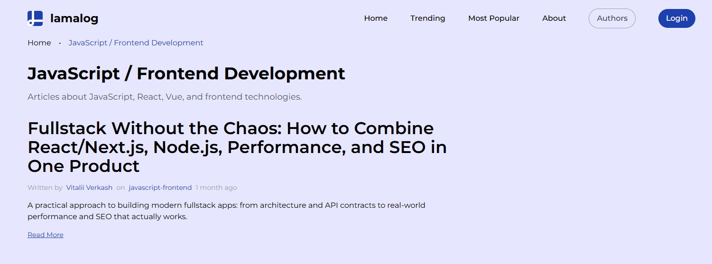
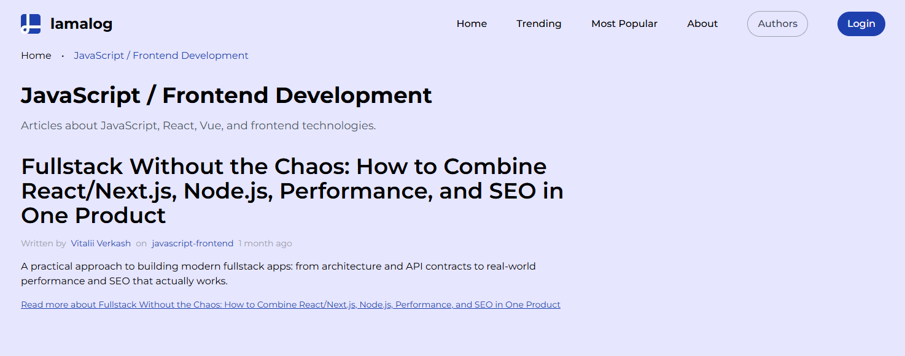
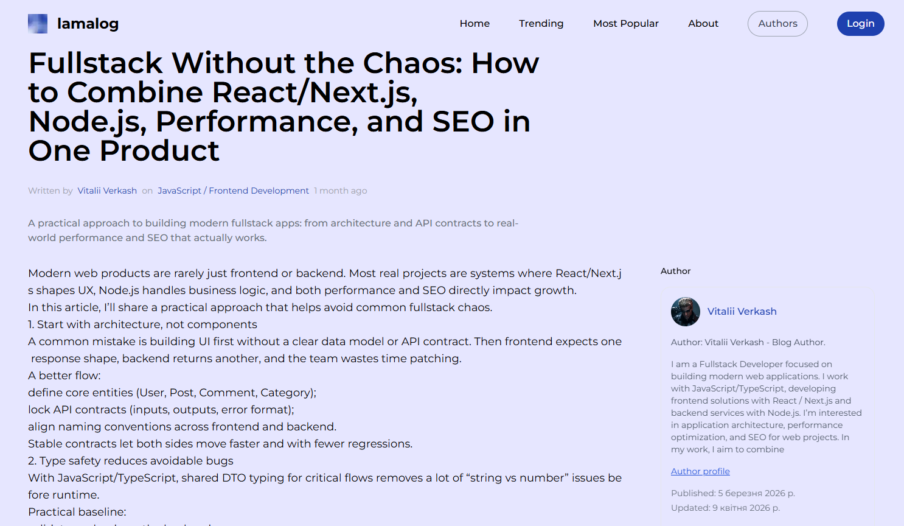
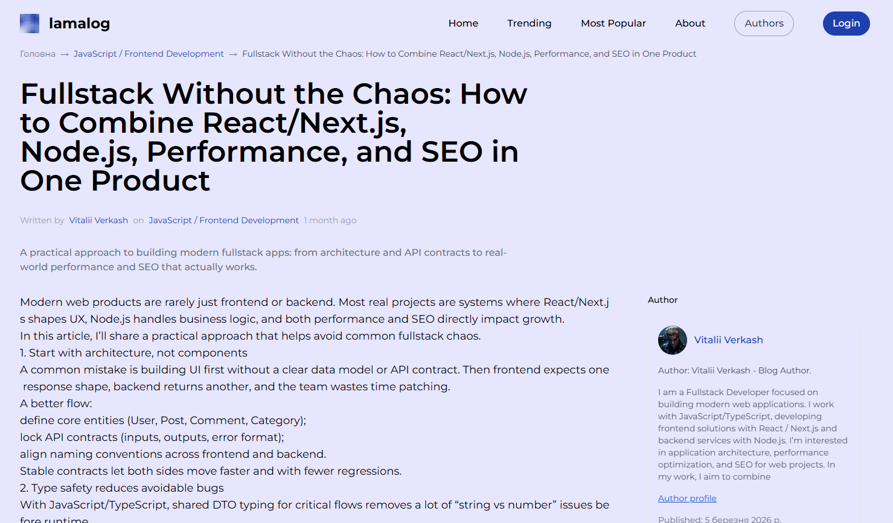
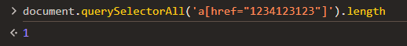
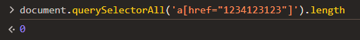

# Лабораторна робота №5. Внутрішня перелінковка

---

## Мета

Навчитись аудитувати внутрішню перелінковку сайту, виявляти типові помилки (orphan pages, надлишкові посилання,
неправильні анкори), будувати схему перелінковки відповідно до silo-структури та впроваджувати виправлення безпосередньо
у проект.

---

## Завдання

### 1. Аудит поточної перелінковки

#### 1.1 - Інвентаризація сторінок

Скласти повний список публічних сторінок свого сайту у Google Sheets (аркуш **"Pages Inventory"**):
## Pages Inventory (унікальні посилання)

| URL | Тип сторінки | Назва | Вхідні посилання | Вихідні посилання | Статус |
|-----|--------------|------|------------------|-------------------|--------|
| / | home | Головна | - | 20+ | linked |
| /posts | listing | All Posts | ~1 | ~10 | linked |
| /posts?sort=trending | listing | Trending | ~2 | ~10 | nav-only |
| /posts?sort=popular | listing | Most Popular | ~2 | ~10 | nav-only |
| /about | static | About | ~2 | ~2 | nav-only |
| /admin/authors | listing | Authors | ~2 | ~5 | nav-only |
| /login | service | Login | ~2 | ~0 | nav-only |
| /write | service | Write Post | ~1 | ~0 | nav-only |
| /categories/general | category | General | ~3 | ~10 | linked |
| /categories/javascript-frontend | category | JavaScript / Frontend | ~4 | ~10 | linked |
| /categories/backend-devops | category | Backend & DevOps | ~4 | ~10 | linked |
| /categories/ai-ml | category | AI & ML | ~2 | ~10 | linked |
| /categories/cybersecurity | category | Cybersecurity | ~1 | ~5 |  nav-only |
| /categories/tools-reviews | category | Tools & Reviews | ~2 | ~5 | linked |
| /articles/1-2 | article | Fullstack Without the Chaos | ~2 | ~2 | linked |
| /articles/ai-isn’t-magic:-what-it-can-and-can’t-do-for-your-code | article | AI Isn’t Magic | ~2 | ~2 | linked |
| /articles/op-op | article | Op Op | ~2 | ~1 | linked |
| /articles/123-2 | article | 123 (variant) | ~2 | ~1 | linked |
| /articles/123 | article | 123 | ~2 | ~1 | linked |
| /articles/devops-for-students:-deploy-without-panic | article | DevOps for Students | ~2 | ~2 | linked |
| /articles/my-story- | article | My story | ~1 | ~1 |  nav-only |
| /articles/1 | article | 1 | ~1 | ~1 |  nav-only |
| /articles/node.js-api-that-doesn’t-hurt:-validation,-errors,-and-structure | article | Node.js API | ~2 | ~2 | linked |
| /articles/vasya-super | article | Vasya Super | ~1 | ~1 |  nav-only |
| /articles/react-state:-5-common-mistakes-and-how-to-fix-them | article | React State | ~1 | ~1 |  nav-only |
| /articles/my-project | article | My project | ~1 | ~1 |  nav-only |
| /articles/the-truth-about-“clean-code”-in-real-projects | article | Clean Code Truth | ~1 | ~1 |  nav-only |
| /articles/як-вася-фіксив-баг,-а-зламав-економіку-проєкту | article | Українська стаття | ~1 | ~1 |  nav-only |
| /authors/user-wyIRHoeo | author | Vitalii Verkash | ~1 | ~5 | linked |
| /authors/user-NxDcJ5lV | author | user-NxDcJ5lV | ~3 | ~5 | linked |
| /authors/user-h1QCOia3 | author | user-h1QCOia3 | ~2 | ~5 | linked |

Для підрахунку вхідних та вихідних посилань - переглянути вихідний код кожної сторінки або використати DevTools.

#### 1.2 - Виявлення orphan pages

**Orphan page** - сторінка на яку не веде жодне внутрішнє посилання. Google може її не знайти навіть якщо вона є в
sitemap.

Перевірити кожну сторінку з інвентарю:

### Аналіз orphan pages

У ході аналізу було визначено, що повністю orphan сторінок (без жодного вхідного посилання) не виявлено.

Однак знайдено значну кількість сторінок зі статусом **nav-only**, тобто таких, що доступні лише через навігаційне меню або списки, але не мають контекстних посилань з інших сторінок.

До них належать:
- статичні сторінки (About, Authors, Login)
- частина статей з низькою кількістю посилань
- окремі категорії

Це негативно впливає на SEO, оскільки:
- знижується внутрішній PageRank
- погіршується crawlability
- сторінки отримують меншу вагу

Рекомендується:
- додати контекстні посилання між статтями
- впровадити блоки "Читайте також"
- посилити перелінковку між категоріями та статтями

Заповнити у таблиці колонку "Статус":

```
linked     - є мінімум одне вхідне посилання
orphan     - жодного вхідного посилання
nav-only   - посилання тільки з навігації (не контекстне)
```

#### 1.3 - Аналіз анкорів

Для 5 будь-яких статей свого блогу переглянути всі вихідні посилання та заповнити таблицю (аркуш **"Anchor Audit"**):

## Anchor Audit

| Сторінка-джерело | Анкор текст | URL призначення | Тип анкору | Оцінка |
|------------------|------------|-----------------|------------|--------|
| /articles/1-2 | Fullstack Without the Chaos | /articles/1-2 | exact-match | ⚠ |
| /articles/1-2 | Read More | /articles/1-2 | generic | ❌ |
| /articles/1-2 | javascript-frontend | /categories/javascript-frontend | breadcrumb | ✅ |
| /articles/1-2 | Vitalii Verkash | /authors/user-wyIRHoeo | branded | ✅ |
| /articles/ai-isn’t-magic:-what-it-can-and-can’t-do-for-your-code | AI Isn’t Magic | /articles/ai-isn’t-magic:-what-it-can-and-can’t-do-for-your-code | exact-match | ⚠ |
| /articles/ai-isn’t-magic:-what-it-can-and-can’t-do-for-your-code | Read More | /articles/ai-isn’t-magic:-what-it-can-and-can’t-do-for-your-code | generic | ❌ |
| /articles/ai-isn’t-magic:-what-it-can-and-can’t-do-for-your-code | general | /categories/general | breadcrumb | ✅ |
| /articles/op-op | Op Op | /articles/op-op | exact-match | ⚠ |
| /articles/op-op | Read More | /articles/op-op | generic | ❌ |
| /articles/op-op | backend-devops | /categories/backend-devops | breadcrumb | ✅ |
| /articles/devops-for-students:-deploy-without-panic | DevOps for Students | /articles/devops-for-students:-deploy-without-panic | partial-match | ✅ |
| /articles/devops-for-students:-deploy-without-panic | Read More | /articles/devops-for-students:-deploy-without-panic | generic | ❌ |
| /articles/devops-for-students:-deploy-without-panic | general | /categories/general | breadcrumb | ✅ |
| /articles/node.js-api-that-doesn’t-hurt:-validation,-errors,-and-structure | Node.js API That Doesn’t Hurt | /articles/node.js-api-that-doesn’t-hurt:-validation,-errors,-and-structure | partial-match | ✅ |
| /articles/node.js-api-that-doesn’t-hurt:-validation,-errors,-and-structure | Read More | /articles/node.js-api-that-doesn’t-hurt:-validation,-errors,-and-structure | generic | ❌ |
| /articles/node.js-api-that-doesn’t-hurt:-validation,-errors,-and-structure | general | /categories/general | breadcrumb | ✅ |

Типи анкорів для класифікації:

| Тип               | Опис                    | Приклад                       | SEO оцінка                  |
|-------------------|-------------------------|-------------------------------|-----------------------------|
| **exact-match**   | Точне входження keyword | "react hooks tutorial"        | ⚠️ використовувати обережно |
| **partial-match** | Часткове входження      | "гайд по хукам"               | ✅                           |
| **descriptive**   | Описовий текст          | "як працює useEffect"         | ✅                           |
| **branded**       | Назва сайту або бренду  | "IT Blog"                     | ✅                           |
| **generic**       | Неінформативний         | "тут", "читати", "click here" | ❌                           |
| **naked URL**     | Голий URL як анкор      | "https://…/article"           | ❌                           |
| **breadcrumb**    | Хлібні крихти           | "JavaScript → Hooks"          | ✅                           |

### Аналіз анкорів

У ході аналізу було виявлено, що на сайті переважають наступні типи анкорів:

- generic (наприклад, "Read More")
- exact-match (назви статей)
- breadcrumb (категорії)
- branded (автори)

Основною проблемою є велика кількість generic-анкорів ("Read More"), які не несуть семантичного навантаження та не допомагають пошуковим системам зрозуміти зміст сторінки.

Також спостерігається обмежене використання descriptive-анкорів, які є найбільш ефективними для SEO.

Позитивним є використання breadcrumb-анкорів, які покращують навігацію та структуру сайту.

### Рекомендації щодо оптимізації анкорів

- замінити "Read More" на описові анкори (наприклад: "детальніше про DevOps deployment")
- додати внутрішні посилання між статтями з descriptive-анкорами
- використовувати partial-match анкори для природності
- уникати надмірного exact-match використання

#### 1.4 - Перевірка глибини кліків

Для кожної статті визначити скільки кліків потрібно від головної сторінки:

```
Норма: будь-яка сторінка досяжна за 3 кліки або менше

Головна (0) → Категорія (1) → Стаття (2) ✅
Головна (0) → Категорія (1) → Підкатегорія (2) → Стаття (3) ✅
Головна (0) → ... → ... → ... → Стаття (4) ❌
```

## Click Depth Analysis

| Сторінка | Шлях від головної | Кількість кліків | Статус |
|----------|------------------|------------------|--------|
| /articles/1-2 | / → /articles/1-2 | 1 | ✅ |
| /articles/ai-isn’t-magic:-what-it-can-and-can’t-do-for-your-code | / → /articles/... | 1 | ✅ |
| /articles/op-op | / → /articles/op-op | 1 | ✅ |
| /articles/123-2 | / → /articles/123-2 | 1 | ✅ |
| /articles/123 | / → /articles/123 | 1 | ✅ |
| /articles/devops-for-students:-deploy-without-panic | / → /articles/... | 1 | ✅ |
| /articles/my-story- | / → /articles/... | 1 | ✅ |
| /articles/1 | / → /articles/1 | 1 | ✅ |
| /articles/node.js-api-that-doesn’t-hurt:-validation,-errors,-and-structure | / → /articles/... | 1 | ✅ |
| /articles/vasya-super | / → /articles/... | 1 | ✅ |
| /articles/react-state:-5-common-mistakes-and-how-to-fix-them | / → /articles/... | 1 | ✅ |
| /articles/my-project | / → /articles/... | 1 | ✅ |
| /articles/the-truth-about-“clean-code”-in-real-projects | / → /articles/... | 1 | ✅ |
| /articles/як-вася-фіксив-баг,-а-зламав-економіку-проєкту | / → /articles/... | 1 | ✅ |                |                                                          |                  |        |

### Аналіз глибини кліків

У ході аналізу було визначено, що всі статті сайту доступні з головної сторінки за 1 клік.

Це відповідає рекомендаціям SEO, згідно з якими будь-яка сторінка повинна бути доступна не більше ніж за 3 кліки від головної.

Позитивним є те, що:
- сайт має плоску структуру
- всі статті легко доступні для користувачів та пошукових систем
- забезпечується швидка індексація контенту

Недоліком такої структури є відсутність глибокої ієрархії та слабка внутрішня перелінковка між статтями.

#### 1.5 - Типові помилки - чек-ліст аудиту

Перевірити свій сайт на кожну помилку:

| Помилка | Присутня | Де саме | Як виправити |
|--------|----------|---------|--------------|
| Orphan pages | Ні | Всі сторінки мають хоча б 1 вхідне посилання | — |
| Generic анкори ("тут", "Read More") | Так | Всі статті (кнопки "Read More") | Замінити на descriptive анкори ("читати про DevOps", "детальніше про React") |
| Посилання на себе (self-link) | Так | Заголовки статей ведуть на ту ж сторінку | Прибрати або замінити на неактивний текст |
| Зламані внутрішні посилання (404) | Так | /articles/123-2 містить некоректний URL "1234123123" | Видалити або замінити на валідний URL |
| Надлишкова перелінковка (10+ посилань на абзац) | Ні | Не виявлено | — |
| Глибина кліків > 3 | Ні | Всі сторінки доступні за 1 клік | — |
| Посилання через JS (onclick) замість `<a href>` | Ні | Використовуються стандартні `<a>` | — |
| Nofollow на внутрішніх посиланнях | Ні | Не виявлено атрибутів nofollow | — |

### Висновок

У ході аудиту внутрішньої перелінковки було виявлено, що сайт має базово правильну структуру без критичних помилок, таких як orphan pages або надмірна глибина кліків.

Основними проблемами є:
- використання generic-анкорів ("Read More")
- наявність self-links
- поодинокі некоректні посилання

Загалом структура сайту є SEO-дружньою, однак потребує покращення якості анкорів та внутрішньої перелінковки між статтями.

---

### 2. Побудова схеми перелінковки

## 2.1 Принципи перелінковки для IT блогу

### Горизонтальна перелінковка (всередині категорій)

- Категорія (/categories/javascript-frontend) → всі статті цієї категорії
- Стаття → 2–4 статті з тієї ж категорії ("Читайте також")
- Стаття → категорія (breadcrumb)

Приклад:
- /articles/1-2 → /articles/react-state...
- /articles/1-2 → /categories/javascript-frontend


### Вертикальна перелінковка (між рівнями)

- Головна (/) → всі категорії
- Головна → останні статті (/articles/...)
- Категорія → статті
- Стаття → категорія + автор


### Перехресна перелінковка (між категоріями)

ДОПУСТИМО:
- DevOps → Backend (логічний зв’язок)
- AI → Backend (API / ML integration)

НЕБАЖАНО:
- Frontend → Cybersecurity (без контексту)
- Tools → AI (якщо нема зв’язку)

#### 2.2 - Схема у Google Sheets

На аркуші **"Link Scheme"** побудувати повну схему перелінковки у вигляді таблиці:

| Звідки (URL) | Куди (URL) | Анкор текст | Тип посилання | Розміщення | Пріоритет |
|--------------|-----------|-------------|---------------|-------------|-----------|
| / | /categories/javascript-frontend | "JavaScript / Frontend" | nav | header navigation | high |
| / | /categories/backend-devops | "Backend & DevOps" | nav | header navigation | high |
| / | /categories/ai-ml | "AI & ML" | nav | header navigation | high |
| / | /categories/tools-reviews | "Tools & Reviews" | nav | header navigation | high |
| / | /posts?sort=trending | "Trending" | nav | header navigation | high |
| / | /posts?sort=popular | "Most Popular" | nav | header navigation | high |
| / | /articles/1-2 | "Fullstack Without the Chaos" | contextual | featured block | high |
| / | /articles/ai-isn’t-magic:-what-it-can-and-can’t-do-for-your-code | "AI Isn’t Magic" | contextual | featured block | high |
| /categories/javascript-frontend | /articles/1-2 | "Fullstack guide" | contextual | article listing | medium |
| /categories/javascript-frontend | /articles/react-state:-5-common-mistakes-and-how-to-fix-them | "React state mistakes" | contextual | article listing | medium |
| /categories/backend-devops | /articles/devops-for-students:-deploy-without-panic | "DevOps guide" | contextual | article listing | medium |
| /categories/backend-devops | /articles/node.js-api-that-doesn’t-hurt:-validation,-errors,-and-structure | "Node.js API guide" | contextual | article listing | medium |
| /categories/ai-ml | /articles/ai-isn’t-magic:-what-it-can-and-can’t-do-for-your-code | "AI in coding" | contextual | article listing | medium |
| /articles/1-2 | /categories/javascript-frontend | "JavaScript / Frontend" | breadcrumb | breadcrumb nav | high |
| /articles/1-2 | /articles/react-state:-5-common-mistakes-and-how-to-fix-them | "React state mistakes" | related | related articles | low |
| /articles/1-2 | /articles/node.js-api-that-doesn’t-hurt:-validation,-errors,-and-structure | "Node.js API guide" | contextual | article body | medium |
| /articles/devops-for-students:-deploy-without-panic | /categories/general | "General" | breadcrumb | breadcrumb nav | high |
| /articles/devops-for-students:-deploy-without-panic | /articles/node.js-api-that-doesn’t-hurt:-validation,-errors,-and-structure | "Node.js backend" | contextual | article body | medium |
| /articles/devops-for-students:-deploy-without-panic | /articles/1-2 | "Fullstack approach" | related | related articles | low |
| /articles/ai-isn’t-magic:-what-it-can-and-can’t-do-for-your-code | /categories/general | "General" | breadcrumb | breadcrumb nav | high |
| /articles/ai-isn’t-magic:-what-it-can-and-can’t-do-for-your-code | /articles/node.js-api-that-doesn’t-hurt:-validation,-errors,-and-structure | "Backend for AI" | contextual | article body | medium |
| /articles/node.js-api-that-doesn’t-hurt:-validation,-errors,-and-structure | /categories/general | "General" | breadcrumb | breadcrumb nav | high |
| /articles/node.js-api-that-doesn’t-hurt:-validation,-errors,-and-structure | /articles/devops-for-students:-deploy-without-panic | "Deployment guide" | contextual | article body | medium |
| /articles/node.js-api-that-doesn’t-hurt:-validation,-errors,-and-structure | /articles/1-2 | "Fullstack system" | related | related articles | low |

Типи розміщення:

- `header navigation` - головне меню
- `breadcrumb nav` - хлібні крихти
- `article listing` - список статей у категорії
- `article body` - всередині тексту статті (найцінніші)
- `related articles` - блок пов'язаних статей
- `footer` - підвал сайту
- `sidebar` - бічна панель

Схема перелінковки побудована з урахуванням принципів SEO:
- високий пріоритет мають навігаційні та breadcrumb-посилання
- контекстні посилання використовуються для передачі релевантності між сторінками
- блоки related articles забезпечують додаткову внутрішню перелінковку

Це дозволяє ефективно розподіляти внутрішній PageRank та покращувати індексацію сайту.

**Мінімальна вимога:** не менше **20 посилань** у схемі.

#### 2.3 - Впровадження блоку пов'язаних статей

Додати на сторінку `/articles/[slug]` блок **"Схожі статті"** який автоматично підбирає статті з тієї самої категорії:

#### 2.4 - Впровадження breadcrumbs

Додати breadcrumbs на сторінку статті:

```
Головна → JavaScript → React Hooks - повний гайд
```

> Breadcrumbs також є основою для **BreadcrumbList JSON-LD** - це буде в наступних лабораторних.

---

### 3. Виправлення виявлених проблем

На основі аудиту (завдання 1) виправити мінімум **3 проблеми** у своєму проекті:

| № | Проблема | Тип                             | Що зроблено | URL де виправлено |
|---|----------|---------------------------------|-------------|-------------------|
| 1 | Generic анкори "Read More" | анкор | Замінено generic анкор на descriptive: `Read more about {title}` | `/posts`, `/categories/*` |
| 2 | Відсутність breadcrumbs на сторінці статті | інше | Додано breadcrumbs: `Головна → Категорія → Стаття` | `/articles/:slug` |
| 3 | Зламане посилання в контенті статті (`1234123123`) | інше | Невалідні `href` нейтралізовано (не рендеряться як клікабельні `<a>`) | `/articles/123-2`, `/articles/:slug` |

Для кожного виправлення - зробити скріншот "до" та "після" у вихідному коді або DevTools.

#### Скріншоти до/після

##### 1) Generic анкор "Read More" → descriptive

**До:**



**Після:**



##### 2) Breadcrumbs на сторінці статті

**До:**



**Після:**



##### 3) Зламане посилання `1234123123`

**До:**



**Після:**



---

### Результати для звіту

```
1. Google Sheets з 3 аркушами:
   - "Pages Inventory"  - інвентаризація сторінок
   - "Anchor Audit"     - аудит анкорів (мін. 5 статей)
   - "Link Scheme"      - схема перелінковки (мін. 20 посилань)

2. Таблиця глибини кліків для всіх сторінок
3. Заповнений чек-ліст типових помилок (п.1.5)
4. Скріншот блоку "Схожі статті" на сторінці статті
5. Скріншот breadcrumbs на сторінці статті
6. Таблиця виправлених проблем (мін. 3) зі скріншотами до/після
```

---

## Контрольні питання

### Рівень 1 - Розуміння термінів

1. Що таке PageRank і як внутрішня перелінковка впливає на передачу "ваги" між сторінками?
2. Що таке orphan page і чому сторінка може бути в sitemap але не бути знайденою Google?
3. Яка різниця між `rel="nofollow"` та `rel="noopener"` на посиланні? Коли використовувати кожен?
4. Чому посилання всередині тексту статті (contextual links) цінніші для SEO ніж посилання в навігації або footer?
5. Що таке "crawl depth" і яке максимальне значення вважається прийнятним?

### Рівень 2 - Аналіз

6. На сторінці категорії є 50 посилань на статті. Чи є це проблемою з точки зору передачі PageRank? Як це впливає на
   кожне окреме посилання?
7. Розглянь два варіанти анкору для посилання на статтю про JavaScript замикання: (а) "читати тут" та (б) "як працюють
   замикання в JavaScript". Поясни детально чому другий кращий з точки зору Google.
8. Твій блог має 3 статті в категорії "JavaScript" і жодна не посилається одна на одну. Як це впливає на silo-структуру
   і передачу авторитету?
9. Що відбудеться з PageRank якщо сторінка посилається сама на себе? Чи є це проблемою?
10. Порівняй передачу "link juice" через header navigation та через contextual посилання в тілі статті. Що сильніше і
    чому?

### Рівень 3 - Синтез та висновки

11. Проаналізуй схему перелінковки свого сайту. Які сторінки отримують найбільше внутрішніх посилань? Чи відповідає це
    їхній важливості для SEO стратегії?
12. Уяви що головна сторінка твого блогу має PageRank 10 (умовно). Побудуй схему як цей "вага" розподіляється по
    сторінках після 2-3 переходів. Яка сторінка отримає найменше?
13. На відомому IT-ресурсі (наприклад dou.ua або ain.ua) проаналізуй схему внутрішньої перелінковки: breadcrumbs,
    related articles, теги, навігація. Що вони роблять що варто запозичити?
14. Як зміниться схема перелінковки якщо блог додасть нову функцію - серії статей (course/series)? Спроектуй нову
    структуру посилань для цього випадку.

---

## Критерії оцінювання

| Завдання                                  | Балів  |
|-------------------------------------------|--------|
| Pages Inventory + виявлені orphan pages   | 2      |
| Anchor Audit - класифікація анкорів       | 2      |
| Глибина кліків + чек-ліст помилок         | 1      |
| Link Scheme - мін. 20 посилань            | 2      |
| Блок "Схожі статті" впроваджено           | 1      |
| Breadcrumbs впроваджено                   | 1      |
| Виправлено мін. 3 проблеми зі скріншотами | 1      |
| **Разом**                                 | **10** |
