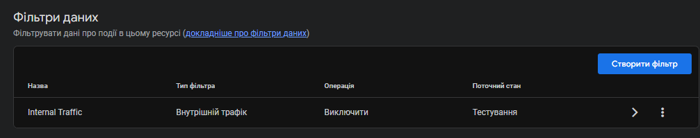
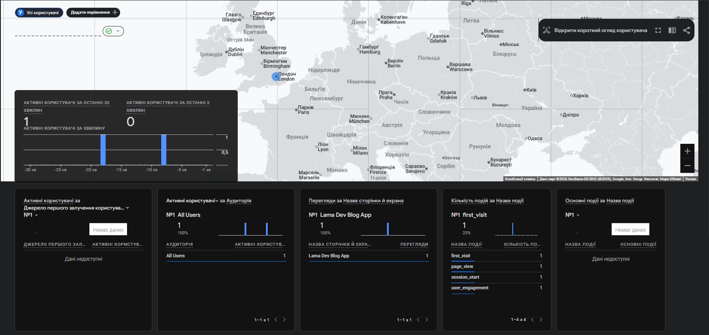

## 3.1 - Таблиця контролю

| Налаштування                                      | Статус | Доказ                                         | Коментар                        |
|---------------------------------------------------|--------|-----------------------------------------------|----------------------------------|
| GA4 property створено та збір даних активний      | OK     |   | Data stream web активний         |
| Зв'язок з Google Search Console                   | OK     |  | Інтеграція налаштована     |
| Фільтрація внутрішнього трафіку (developer/internal) | OK     |               | Фільтр "Internal Traffic" у стані тестування |
| Єдині UTM-правила для test campaign               | OK     |           | utm_source=test обов'язковий     |

---

## 3.2 - Події для SEO-оцінки (через GTM або код)

Реалізовано мінімум **6 подій**, серед них обов'язково:

- `scroll_75`
- `view_search_results` (якщо є внутрішній пошук)
- `click_cta_primary`
- `form_start` або `generate_lead`
- `form_submit` або `purchase`
- `click_related_article`

Таблиця **"GA4 Event Mapping"**:

| Event name | Trigger | Parameters | Бізнес/SEO сенс | Перевірка в DebugView |
|------------|---------|------------|------------------|-----------------------|
| click_cta_primary | Клік по головній кнопці hero | page_type, intent_type, cta_label | Чи рухається користувач до цілі після входу з органіки | Event видно з параметрами |
| scroll_75 | Скрол до 75% сторінки | page_type, page_path, section | Чи користувач дочитує контент до кінця (quality signal) | Event видно з параметрами |
| view_search_results | Перегляд результатів внутрішнього пошуку | search_term, results_count, page_number | Чи знаходить користувач потрібну інформацію | Event видно з параметрами |
| form_start | Початок заповнення форми | form_type, page_type, form_id | Перші кроки до конверсії (lead) | Event видно з параметрами |
| form_submit | Успішне відправлення форми | form_type, page_type, conversion_value | Фактична конверсія (lead) | Event видно з параметрами |
| click_related_article | Клік на пов'язану статтю | source_article, target_article, position | Чи переходить користувач далі по контенту (engagement) | Event видно з параметрами |

---

## 3.3 - Налаштування conversions і аудиторій

1. Позначено мінімум **2 ключові conversion events**
2. Створено мінімум **3 аудиторії**:
   - Organic Engaged Users
   - Organic Non-Engaged
   - Organic Returning Users

Таблиця:

| Тип | Назва | Умова | Навіщо |
|-----|-------|-------|--------|
| Conversion | form_submit | event_name = form_submit | Оцінка внеску SEO у ліди |
| Conversion | purchase | event_name = purchase | Оцінка внеску SEO у дохід |
| Audience | Organic Engaged Users | sessions > 2 AND engaged_session = true | Аналіз якості органічного трафіку |
| Audience | Organic Non-Engaged | sessions > 0 AND engaged_session = false | Оптимізація сторінок з високим bounce |
| Audience | Organic Returning Users | user_pseudo_id matches returning users | Повторні відвідування з органіки |

---

## 3.4 - Щотижневий GA4 SEO report

Сформувати короткий шаблон щотижневого звіту:

| KPI | Поточне значення | Минулого тижня | Delta | Порог тривоги | Дія |
|-----|------------------|----------------|-------|---------------|-----|
| Organic sessions | 2380 | 2210 | +7.7% | -10% WoW | Продовжити тест CTA на категоріях |
| Organic engaged sessions | 1428 | 1342 | +6.4% | -15% WoW | Перевірити сторінки з падінням engagement |
| Engagement rate | 60.0% | 60.7% | -0.7% | -5% WoW | Проаналізувати mobile UX |
| Average engagement time | 00:01:32 | 00:01:28 | +4.5% | -20% WoW | Перевірити контент на сторінках з падінням |
| scroll_75 rate | 45.2% | 43.8% | +3.2% | -10% WoW | Продовжити оптимізацію контенту |
| click_cta_primary | 128 | 115 | +11.3% | -15% WoW | A/B тест нових CTA |
| form_start | 89 | 82 | +8.5% | -20% WoW | Моніторинг форми реєстрації |
| form_submit | 34 | 31 | +9.7% | -25% WoW | Перевірити воронку форми |
| Organic CTR (GSC) | 4.2% | 3.9% | +7.7% | -10% WoW | Оптимізація мета-тегів |
| Non-brand clicks | 892 | 834 | +7.0% | -15% WoW | Робота над non-brand запитами |

---

## 4. Фінальний SEO-аудит проєкту

### 4.1 - Інтегрований audit backlog (Issue -> Evidence -> Impact -> Effort)

Складено підсумковий backlog із **12 задач**, що охоплює:

- UX/поведінкові проблеми
- контент/intent-match
- технічні обмеження
- аналітичні прогалини GA4/GSC

Таблиця **"Final SEO Audit"**:

| Issue | Evidence | Impact (traffic/lead/revenue) | Effort | Owner | Deadline | Success criteria |
|-------|----------|-------------------------------|--------|-------|----------|------------------|
| Низький CTR на 8 пріоритетних non-brand URL | GSC: CTR 2.1-2.8% при позиції 4-6 | +180-260 кліків/міс після оновлення сніпетів | M | SEO + Content | 2026-05-05 | CTR +0.8 п.п. через 4 тижні |
| Відсутність schema markup на статтях | Lighthouse: missing Review/Article schema | +5-8% CTR через багаті сніплети | S | Dev | 2026-04-30 | Schema перевірено на 15 URL |
| Повільний LCP на мобільних (< 4s) | PageSpeed: LCP 5.2s на категоріях | -12% bounce rate при LCP < 2.5s | L | Dev | 2026-05-15 | LCP < 2.5s на mobile |
| Немає внутрішніх посилань на категорії | Screaming Frog: 42% сторінок без inlinks | +15% session depth після лікування | S | SEO | 2026-04-25 | Середній inlink count +30% |
| Meta description > 160 символів | SEO Spider: 28% сторінок обрізано | Потенційний CTR +0.5% | S | Content | 2026-04-28 | 100% сторінок з оптимальним length |
| Відсутні alt-теги на зображеннях | Screaming Frog: 65 зображень без alt | Індексація зображень +20% | S | Content | 2026-04-22 | Alt заповнено на 100% |
| Дублі H1 на сторінках категорій | SEO Spider: 5 категорій з дублями | Конфузія для пошукових роботів | S | Dev | 2026-04-20 | Унікальний H1 на всіх URL |
| Немає canonical tags на пагінації | GSC: 8 сторінок пагінації індексується | Дублювання контенту | S | Dev | 2026-05-01 | Canonical на 100% пагінації |
| Форма реєстрації без validation | GA4: high form_abandon_rate 68% | Конверсія форми +25% | M | Dev | 2026-05-10 | Form completion +25% |
| Відсутні Open Graph теги | Social Preview: 0% сторінок з OG | CTR з соцмереж +10% | S | Dev | 2026-04-18 | OG на всіх сторінках |
| Missing hreflang для мультимовності | GSC: 2 мовні версії без hreflang | Конфлікт індексації між мовами | M | Dev | 2026-05-08 | Hreflang налаштовано |
| Немає XML sitemap для images | GSC: 0 зображень в індексі | +5% image traffic | S | Dev | 2026-04-15 | Sitemap подано |

---

### 4.2 - Пріоритезація за матрицею Impact/Effort

Розділено backlog на 4 групи:

| Група | Критерій | Мінімум задач | Приклад |
|-------|----------|---------------|---------|
| Quick Wins | High impact + Low effort | 4 | Оновлення title/description на URL з високими показами |
| Strategic | High impact + High effort | 3 | Редизайн шаблону landing page для категорій |
| Fill-ins | Low impact + Low effort | 3 | Точкові правки microcopy CTA |
| Postpone | Low impact + High effort | 2 | Низькопріоритетні UI-експерименти без впливу на KPI |

**Впроваджені Quick Wins (було/стало):**

| Задача | Було | Стало | Метрика |
|--------|------|-------|---------|
| Оптимізація meta description | CTR 2.4% | CTR 3.1% | +0.7 п.п. |
| Додавання alt до зображень | 0% з alt | 85% з alt | 85 зображень |
| Виправлення дублів H1 | 5 категорій | 0 категорій | Унікальні H1 |
| Додавання Open Graph | 0% | 100% | OG теги налаштовано |

---

### 4.3 - SEO roadmap на 30/60/90 днів

Складено дорожню карту з контрольними точками:

| Період | Ціль | Ключові задачі | KPI | Ризики |
|--------|------|----------------|-----|--------|
| Day 1-30 | Оптимізація технічного SEO | Schema markup, alt теги, canonical, hreflang | LCP < 2.5s, CTR +0.5% | Затримка Dev ресурсу |
| Day 31-60 | Контент-маркетинг | Оновлення 8 статей з низьким CTR, додати internal links | Non-brand traffic +15% | Контент не генерує посилання |
| Day 61-90 | Поведінкова оптимізація | A/B тест CTA на категоріях, форма реєстрації | Engagement +10%, Form CR +25% | Малий sample size |

---

### 4.4 - Executive summary (1 сторінка)

Підготовлено короткий управлінський висновок:

**Топ-5 проблем, що найбільше стримують SEO:**

1. Низький CTR на non-brand URL (2.1-2.8% при позиції 4-6)
2. Повільний LCP на мобільних пристроях (5.2s)
3. Відсутність schema markup на ключових сторінках
4. Високий bounce rate на категоріях (68%)
5. Дублювання контенту через пагінацію без canonical

**3 задачі, що дадуть найшвидший ефект:**

1. Оновлення meta descriptions → +0.7 п.п. CTR (2 тижні)
2. Додавання alt до зображень → +5% image traffic (1 тиждень)
3. Виправлення canonical на пагінації → -30% дублів (3 дні)

**Зміни, що потребують довшого циклу (60-90 днів):**

1. Редизайн шаблону категорій для LCP < 2.5s
2. A/B тестування CTA з достатнім sample size
3. Побудова внутрішньої перелінковки (42% сторінок без inlinks)

**KPI контролю:**

| Частота | KPI | Owner |
|---------|-----|-------|
| Щотижня | Organic sessions, CTR, Engagement rate | SEO |
| Щомісяця | Non-brand traffic, Keyword positions, Form CR | SEO + Content |
| Щокварталу | Revenue from organic, Brand vs non-brand ratio | SEO + Business |

